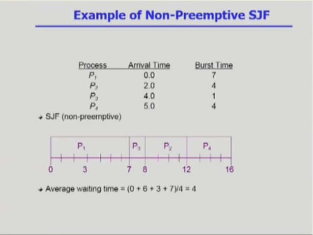
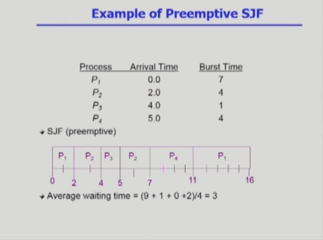
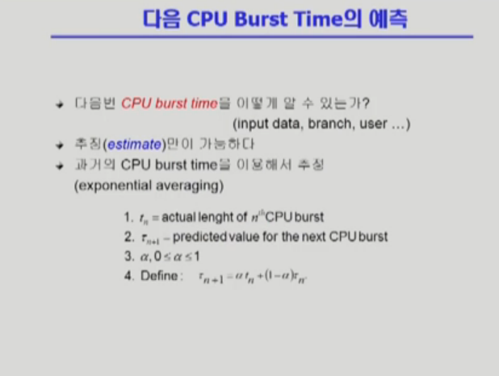

```
이번 시간에는 CPU 스케줄링 설명드리겠습니다.

컴퓨터 프로그램이 실행될때는, 이와같은 단계를 거칩니다.
즉, CPU에서 인스트럭션을 실행하는 단계와 오래걸리는 IO 작업을 하는 단계.
이런 일련의 단계를 번갈아가면서 실행하는게 모든 프로그램의 실행에서 거치게 되는 경로입니다.
물론 프로그램 종류마다 조금씩 다르죠. IO가 빈번히 끼어들지 않는 그런 프로그램의 경우는
CPU에서 인스트럭션 실행하는 단계. 우리가 그걸 CPU 버스트라고 부르죠. 그게 굉장히 길게 나타날것이구요.
거기에 비해서 사람하고 인터랙션하는 프로그램인 경우 중간중간 화면 출력 나가고 키보드 입력받고 그러기 때문에
중간에 IO가 끼어들게 됩니다. 자연스럽게 시피유 연속적으로 쓰는 단계가 짧아지게 되겠죠.
연속적으로 쓰는 시간을 그래프로 뽑아보면, 이렇게 CPU 버스트가 짧은 경우가 빈번하고 굉장히 긴 경우도 간혹가다 나타난다는 것이죠.

컴퓨터 시스템에서 돌아가는 프로그램은 모두 동일한 패턴을 가지는 것이 아니고, 긴 경우랑 짧은 경우가 섞여 있는 것이죠.
그래서 CPU 스케줄링이라는게 필요한겁니다.
이런 잡 (사용자와 인터랙션 하는)에게 CPU가 너무 늦게 돌아가면, 응답시간이 늦어져서 사람이 좀 오래기다려야 되기 때문에 답답한 거죠.
그래서 cpu 스케줄링이라는 것은 레디큐에 들어와있는, 즉 시피유를 얻고자 하는 프로세스 중에서 어떤 프로세스한테 시피유를 줄것인지를
결정하는 그런 매커니즘이 시피유 스케줄링인데요.

크게 두가지 이슈가 있죠. 하나는, 이런 시피유 버스트에 들어온 프로그램이 여럿이 있는데 누구한테 당장 먼저 시피유를 줄것인가에 대한 문제.
또 하나는, 이 프로그램에게 시피유 줬으면 IO 하러 나갈때까지 시피유를 계속 주느냐. 아니면 CPU 버스트가 너무 길기 때문에 중간에 시피유를 뺏어서
다른 프로세스한테 시피유를 넘겨주느냐.

즉, 누구한테 줘야할지 결정해야하고 일단 줬으면 계속 쓰게 할것인지 중간에 시피유를 뺏어올수도 있게 할것인가. 이게 시피유 스케줄링에서 중요한 두가지 이슈가 되겠습니다.
특히 두번째 이슈, 시피유 주고나서 뺏지 않고 다 쓰고 나갈때까지 보장해준다고 하면.. 예를 들어서 시피유 버스트 굉장히 긴 이런 프로그램한테 시피유 한번
넘어가게 되면 그 뒤에 도착하는 IO바운드 잡들. 시피유 좀만 주면 바로 쓰고 나갈 프로그램인데도 불구하고 긴 프로세스 하나가 시피유 잡고 안내놓으면 이 친구들은
줄서서 오래 기다려야 하는거죠. 그래서 지나치게 오래 기다리지 않는 방향으로 가야된다는 것이 중요하겠습니다.

그래서 지금 말씀드린대로 시피유 스케줄링 알고리즘이 여러가지 소개가 될텐데요, 크게 두가지로 나누어보면 하나는 nonpreemptive한 스케줄링이고. 즉 강제로
시피유 빼앗지 않는 방법. 일단 한번 줬으면 그 프로그램이 다 쓰고 나갈때까지 이 친구한테 시피유 보장해주는 방법. 우리말로는 이것을 비선점형이라고 합니다.

그다음에 강제로 빼앗을 수 있는 방법. 프로그램이 계속 시피유 쓰고 싶지만 강제로 빼앗을 수 있는.. 타이머라는 하드웨어 두고 인터럽트 해서 뺏을 수 있다는건 이미 설명드렸습니다. 현대적인 시피유 스케줄링은 사실... preemptive한.. 선점형 스케줄링을 거의 쓰고 있습니다.
그래서, 지금부터 소개해드릴 시피유 스케줄링들은 크게 비선점형, 선점형. 두가지 방법으로 나뉘게 됩니다.

```

### Scheduling Algorithms
* FCFS (First-Come First-Served)
* SJF (Shortest-Job-First)
* SRTF (Shortest-Remaining-Time-First)
* Priority Scheduling
* RR (Round Robin)
* Multilevel Queue
* Multilevel Feedback Queue

```
그러면, 스케줄링 알고리즘이 어떤게 좋은지 평가할 수 있는 성능 척도가 필요할텐데요. Scheduling Criteria라고 부르고. 또 일반적으로 성능을 측정할 수 있는 방법을 퍼포먼스 인덱스. 퍼포먼스 매져. 이렇게 부르기도 합니다.

```

### Scheduling Criteria (Performance Index)
* CPU utilization (이용률)
    * keep the CPU as busy as possible
* Throughput (처리량)
    * # of processes that complete their execution per time unit
* Turnaround time (소요시간, 반환시간)
    * amount of time to execute a particular process
* Waiting time (대기 시간)
    * amount of time a process has been waiting in the ready queue
* Response time (응답 시간)
    * amount of time it takes from when a request was submitted until the first response is produced, not output
    (for time-sharing environment)

```
여러가지가 있는데 이걸 또 크게 두가지로 분류 할 수 있습니다.
하나는 시스템 입장에서의 성능척도입니다. 나머지 하나는 프로그램 입장에서의 성능척도입니다.
시스템 입장에서의 성능척도라는거는, 시피유 하나 가지고 일을 최대한 많이 시키면 좋은거겠죠.
이용률, 쓰루풋 이렇게 두가지로 이야기하게 되고.
프로그램, 프로세스 입장에서의 성능척도는 내가 시피유를 빨리 얻어서 빨리 끝나면 좋은거죠.
그래서 시간을.. 얼마나 빨리 처리할 수 있느냐. 그런 척도를 세가지로 세분화해서 얘기하게 됩니다.

맨위에 나와있는 시피유 이용률이라는건, 전체 시간중에서 시피유가 놀지 않고 일한 시간의 비율을 나타냅니다.
여기 써있는 표현대로 살펴보자면 시피유는 가능한, 바쁘게 일을 시켜라 이말이죠.
시피유라는건 굉장히 비싼자원이기 때문에 놀리지 말고 최대한 일을 시켜서 이런 비율을 높게 하는것이 시피유 입장에서 시피유를 잘쓰는 방법이라는거죠.
두번째로 나와있는 쓰루풋. 이건 처리량 산출량 이렇게 얘기하는데 주어진 시간동안 과연 몇개의 일. 몇개의 작업을 완료했느냐. 그걸 나타내는거죠
주어진 시피유를 이용해서 가능하면 더 많은 일을 처리하는것이 좋겠죠.

그다음에 밑에 이 세가지는, 고객 입장. 시피유 스케줄링이기 때문에 프로세스 입장에서의 성능척도입니다. 가능하면 내가 빨리 서비스를 받고, 여기서 인제 기다리다가.. 시피유 버스트 하기 위해서 들어와서 기다리다가.. 시피유 빨리 잡아서 쓰고 아이오 하러 나가고 싶겠죠.
프로세스 입장에서의 성능 척도라는건 시간이 빨리 처리되는게 중요한데 그걸 세가지로 나눈겁니다.
첫번째로 턴 어라운드 타임. 소요시간 반환시간 이런 표현 쓰더라구요. 좀 헷갈리기 때문에 턴 어라운드 타임이라는 표현을 쓰겠습니다.
턴 어라운드 타임이라는거는 시피유를 쓰러 들어와서, 다 쓰고 나갈때까지 걸린 시간을 말하는겁니다.
그다음에 웨이팅 타임은, 기다린 시간을 의미합니다. 즉, 시피유를 쓰고자하더라도 하나밖에 없기 때문에 레디큐에 줄서서 기다리겠죠.
그 순수하게 기다린 시간을 웨이팅 타임이라고 하고, 본인이 실제로 러닝을 한 시간을 합친건 턴 어라운드 타임이구요.
그 다음에 마지막으로 이 리스폰스 타임. 응답시간이라는 것이 있는데, 이 레디큐에 들어와서 (시피유 쓰겠다고 들어와서) 처음으로 시피유 얻는데 걸린 시간입니다. 이게 웨이팅 타임이랑 어떻게 다른지 구분해서 설명해드리자면 선점형 스케줄링은 시피유 한번 얻었다고 해서 끝까지 쓰는게 아니죠.
계속 줄서서 기다리고 받아서 쓰고 반복되는데.. 그 기다린 시간을 다 합친 개념이 웨이팅 타임이고. 리스폰스 타임이라는 것은 최초의 CPU 얻기까지 기다린 시간을 말하는 것이죠.

그러면 굳이 이렇게 그 시간과 관련된 성능척도를 세개씩이나 나눠서 이야기하는 이유가 있는가. 그 중에서 특히 응답시간이라는걸 둔 이유는 타임쉐어링, 시피유를 얻었다 뺏었다 하는 환경에서는 어쨌든 처음으로 시피유를 얻는 시간이 사용자 응답과 관련해서 굉장히 중요한 시간 개념이라는 것이죠.
대기시간도 있고, 반환시간도 있지만 응답시간의 개념을 별도로 도입해서 이야기 하는겁니다.
그래서 이거는 이해하시기 쉽게 중국집에 비유해서 많이 설명하는데, 제가 중국집 운영하는 입장으로 주방장을 고용했습니다.
주인 입장에서 주방장에게 일을 많이 시키는게 좋겠죠. 그러므로 주인(시스템) 관점에서 봤을 때 시스템과 관련된 척도는 주방장이 놀지 않고 일한 시간의 비율. 이게 유틸라이제이션이죠. 이게 높으면 좋겠죠. 노는시간이 많으면 적절하지가 않겠죠.
쓰루풋은 단위시간당 얼마나 많은 손님에게 밥을 먹여서 내보냈는가. 손님이 많은게 주인장 입장에서는 좋겠죠.

밑에 세개는 손님 입장에서의 척도입니다. 턴 어라운드 타임은 주문을 하고나서 식사하고 다 먹고 나갈때까지 걸린 시간.
물론 짜장면 같은거 하나 시키면 주문해서 바로 먹고 나가겠지만, 코스 요리같은 경우는 중간에 요리가 나오면 먹고. 다음 요리 나오면 먹고. 기다리는 시간이 있겠죠.
이제 중국집에서 짜장면 하나 시키는 손님이 있는가하면, 5만원짜리 코스 시키는 손님도 있다. 생각해서 스케줄링 해야된다는 것이죠.
그리고 웨이팅 타임은 손님이 밥을 먹은 시간 말고. 기다린 시간들을 우리가 웨이팅 타임이라고 부르는 것이죠.
마지막에 나와있는 리스폰스 타임이라는거는 첫번째 음식이 나올때까지 기다리는 시간이 되겠죠. 손님이 중국집에 오는 경우는 배가 고파서 온건데, 너무 오래 걸리면 큰일납니다. 제일 먼저 단무지라도 내주면 그걸 먹고 허기를 달랠 수 있는게 있겠죠. 응답시간도 굉장히 중요한 성능 척도라고 볼 수 있습니다.

이제 여러가지 시피유 스케줄링 알고리즘에 대해 설명드리겠습니다. 첫번째는 FCFS (First-Come First-Served). 먼저 온 고객을 먼저 서비스해주는 그런 스케줄링 방법이죠. 사실은 스케줄링이라고 말씀드리기도 민망한데.. 그냥 먼저 온 순서대로 처리하는겁니다.
사람들 사이에서는 이 스케줄링을 많이 사용하고 있죠. 먼저 온 고객 먼저 처리하고, 화장실 먼저 들어가면 볼일 다 보고 나올때까지 그 시간 보장되고.
FCFS는 앞의 스케줄링 분류에서 비 선점형입니다. 한번 획득하면 끝날때까지 빼앗기지 않는...
그래서 FCFS는 사실 그렇게 효율적이지 않아요. 이미 예를 들었지만, 시피유 오래쓰는 애가 도착해서 오래잡아버리면 아주 시피유 짧게 쓰는 애들이 도착하더라도 기다려야 되는것이죠. (길게 쓰는애가 다쓰고 놓을때까지)

여길보시면, 세개가 동시에 도착했는데 아주아주 간발의 차이로 p1이 먼저 도착하고 그다음이 p2, p3. 이런 순서로 도착한겁니다.
이런걸 우리가 간트차트라고 하는데, x축이 시간축이구요. cpu의 스케줄링된 프로세스를 시간순서에 따라서 보여주고 있는겁니다.
그래서 이 FCFS 스케줄링에서는 3개의 프로세스중 p1이 CPU를 먼저 장악해서 쓰고.
두번째 도착한... 비록 0초만에 도착했지만 늦게 도착하는 바람에 p1이 끝난 24초부터 쓰는거고.
두번째가 시피유를 놓게되면 세번째 프로세스가 27초부터 시피유를 얻게되는것이죠.

이런식으로 시피유를 오래 잡고 있는 프로세스가 있으면, 인터랙티브 잡의 응답시간이 대단히 길어지기 때문에.. FCFS는 별로 좋은 스케줄링이 아니라는 것이죠.
웨이팅 타임을 구해보면, 기다린 시간이 이렇게 표현이되고. 웨이팅 타임의 평균을 내면 (0+24+27) / 3 = 17
p1이 기다린 시간은 없지만, 그 뒤에 도착한 친구들은 기다리는 시간이 아주 길어져서 평균도 길어지게 됩니다.

간발의 차이로 시피유를 짧게 쓰는 애들이 먼저 도착했다고 하면 아주 다른 결과가 나옵니다.
(p2 0~3, p3 3~6, p1 6~30) 이친구는 전혀 기다리지 않았고, 이친구는 3초, 이친구는 6초를 기다렸죠. 계산을 해보면 웨이팅 타임이 평균 3초밖에 안됩니다.

중국집에서도 예를 들어보면, FCFS 스케줄링을 쓰는데 어떤 고객이 도착해가지고 다섯시간 걸리는 유리를 주문했습니다. 그럼 주방장이 다섯시간짜리 요리를 계속 하고 있겠죠. 뒤에 짜장면 먹으러 온 손님들은 다섯시간 이상을 기다려야하는 문제가 있습니다.

이렇게 짧은 프로세스들이 오래기다려야되는 현상을 우리가 Convoy Effect라고 부릅니다. 별로 좋은 현상이 아니겠죠...

근데 Convoy Effect라고 하면 우리말로 호위 효과. 뭔가 호위를 받는것 같은 효과인데.. 이런 케이스는 앞에 똥차가 하나 버티고 있기 때문에 서비스를 못받고 오래 기다려야되는 나쁜 효과를 의미하는 그런 표현으로 쓰이게 된거죠.

* The convoy effect is the slow down of traffic due to queuing caused by slow

FCFS 스케줄링 들으면서 느끼셨겠지만, CPU 스케줄링 별거 없다. 그렇게 느끼실거에요. 어떻게하면 좋은 스케줄링이 되느냐.
CPU 짧게 쓰는 프로그램한테 먼저 주는게 효과적일거라고 생각하실겁니다.
그렇게 해서 나온게 SJF (Shortest-Job-First) 입니다. CPU Burst가 제일 짧은 작업한테 먼저 주는 스케줄링이라는 것이죠.

이렇게 되면, 전체적으로 보면 행복한 결과가 나오게 됩니다.
화장실에서 줄서서 볼일을 볼때도 어떤 변비가 있는 친구 하나가 두시간을 잡고 있게 되면, 나머지 친구들도 1분 내로 볼일 보고 나올 수 있는 것을 두시간 넘게 기다리게 되기 때문에... 평균 대기시간을 구하면 굉장히 커지게 되죠. 근데 그걸 반대로 생각하면.
매번 화장실에 줄서있는 사람중에서 제일 볼일을 빨리 볼 수 있는 사람한테 먼저 화장실 사용권을 주는겁니다. 그럼 큐가 전체적으로 짧아집니다.
짧은 사람은 바로 쓰고 나갈거기 때문에. 전체적인 줄이 짧아져서, 웨이팅 타임이 줄어들고 평균 웨이팅 타임이 가장 적어집니다.
그래서 SJF 스케줄링 알고리즘이 평균 웨이팅 타임을 가장 최소화 하는 알고리즘으로 알려져 있습니다.

```
### SJF (Shortest-Job-First)
* 각 프로세스의 다음번 CPU burst time을 가지고 스케줄링에 활용
* CPU burst time이 가장 짧은 프로세스를 제일 먼저 스케줄
* Two schemes:
    * Nonpreemptive
        * 일단 CPU를 잡으면 이번 CPU burst가 완료될 때까지 CPU를 선점(preemption) 당하지 않음
    * Preemptive
        * 현재 수행중인 프로세스의 남은 burst time보다 더 짧은 CPU burst time을 가지는 새로운 프로세스가 도착하면 CPU를 빼앗김
        * 이 방법은 Shortest-Remaining-Time-First (SRTF) 이라고도 부른다
* SJF is optimal
    * 주어진 프로세스들에 대해 minimum average waiting time을 보장

```
그런데 이 SJF 알고리즘도, 두가지 방식을 나누어서 생각해볼 수가 있겠습니다.
아까 시피유 스케줄링은 선점/비선점으로 나누어서 설명드릴 수 있다고 했는데, SJF도 넌 프림티브한 경우에는 기다리는 프로세스중에서 제일 짧게 쓰는 프로세스가 있어서 그 친구한테 줬으면.. 더 짧은 친구가 도착해도 CPU 사용권을 보장해주는 방식입니다.
반면에 프림티브한 방법은 시피유 줬다 하더라도 더 짧은 프로세스가 도착하면 CPU를 뺏어가지고 그 친구한테 줄 수 있는 그런 방법입니다.
이 SJF의 프림티브한 방식을 우리가 Shortest-Remaining-Time-First 방식이라고 부르기도 합니다.

그럼 이 최소 평균 웨이팅 타임을 보장하는 방식은 둘중 어떤걸까요? 바로 프림티브 버전입니다.

이 두가지 SJF 버전의 예를 보여드리겠습니다.
```

```

일단 0초 시점에 누구한테 CPU 줄지 결정해야되는데, 지금 보면 0초에 도착한게 P1밖에 없죠. 그래서 P1이 얻게 되고.
넌 프림티브이니 P1이 원하는 만큼 CPU를 쓰고 반납하게 됩니다.
이제 그 시점에서 도착한 프로세스를 봤더니 P2~P4 다 도착해있죠. 그중에서 시간이 제일 짧은 P3이 얻게 되고, 그다음에 짧은 순서로 얻게 됩니다.
평균 대기시간은 4초로 구해지게 됩니다.

이번엔 Preemptive 버전을 보겠습니다.
```

```
이거는 프림티브 버전이기 때문에 P1이 시피유를 얻었지만, 더 빠른게 들어오면 빼앗길 수 있다는 것이죠.
(잠시 프림티브 버전 설명..)

사실 SJF는 두가지 문제점이 있습니다.
이 SJF는 극단점으로 시피유 시간이 짧은 잡을 선호합니다. 시피유 사용시간이 긴 프로세스는 영원히 서비스를 못받을 수도 있습니다.
예를 들어 사용시간이 1초인 프로세스들이 있어서 쓰고 있어요. 그럼 100초짜리는 기다려야겠죠. 그래서 1초짜리들이 다 쓰고나서 '아 드디어 내 차례가 오는구나..' 했는데 갑자기 5초짜리들이 뭉치로 도착하면 또 기다려야되는거죠.
예를 들어서 여러분이 화장실에서 줄서서 기다리는데 그 화장실은 SJF 스케줄링을 쓰고 있습니다. 내 볼일 보는 시간은 10분이에요.
근데 1분짜리인 친구들이 열명이 있어서 10분 기다리면 되겠지 했는데, 이 친구들이 나가고나서 1분짜리 볼일 보는 친구들이 백명 도착해요. 그럼 또 백분 기다려야겠죠. 어렵게어렵게 100분 또 기다리는데 갑자기 어디서 천명이 도착하고. 이 사람은 영원히 화장실을 못들어가는 문제가 생기게 됩니다.

그게 바로 스타베이션 문제라는겁니다. 우리말로 굳이 번역을 하면 기아 현상이죠. 굶어죽는겁니다.
* https://en.wikipedia.org/wiki/Starvation_(computer_science)

그다음에, SJF의 두번째 문제점은 CPU 사용시간을 미리 알 수 없다는게 문제입니다.
프로그램이라는게 실행이 되다보면, 어떤 인풋을 받아서 실행이 되기도 하고 if 문을 만족을 하느냐 안하느냐 따라서 브랜치가 일어나고 유저 인풋도 있고.
그래서 이번에 내가 CPU를 얼마나 쓰고 나갈지를 미리 알 수가 없다는게 문제입니다.
SJF설명 드리면서 요 시간이 짧은 프로세스한테 CPU를 준다 말씀드렸지만, 실제로는 본인이 얼마나 쓰고 나갈지조차 알 수 없는 상황이기 때문에
실제 시스템에서 SJF를 사용할수 없겠죠.

그러면 정말 사용할수가 없는거냐하면.. 그렇지는 않아요. 우리가 CPU 사용시간을 미리 알수는 없지만 추정은 할 수 있습니다.
프로그램 종류에 따라서 IO바운드 프로세스 사람들하고 인터랙션을 하는 프로그램들은 CPU 버스트들이 되게 짧게 나타나고.
또 CPU 바운드 잡, 뭔가 과학 계산 응용 프로그램같은건 계산시간이 굉장히 길고. 이런 특징이 있기 때문에
예측은 할수가 있죠. 과거에 시피유를 사용한 흔적을 보고, 그거를 통해서 이 친구가 시피유가 얼마나 쓸지 예측을 하면 된다는겁니다.
물론 정확하진 않겠지만, 되게 프로그램들이 비슷한 패턴을 나타내기 때문에 그런 예측이 가능하다는 것이죠.

```
### 다음 CPU Burst Time의 예측
* 다음번 CPU burst time을 어떻게 알 수 있는가? (input data, branch, user, ...)
* 추정 (estimate)만 가능하다
* 과거의 CPU burst time을 이용해서 추정 (exponential averaging)


```
이 운영체제 수업에서 수식이 등장하는 경우는 거의 없는데, 그게 오늘 등장한겁니다.
여기보시면 노테이션이 나오는데, T라고 주어진 노테이션이 있고, 타우라고 주어진 노테이션이 있습니다.
t는, 실제 시피유 사용시간이고 타우는 시피유 사용을 예측한 시간입니다.

여기 아래첨자가 붙어있는거는 n번째 cpu 실제 사용시간 / n+1번째 cpu 사용 예측치를 나타낸거죠.
예측하는 식은 이렇게 주어집니다.
n+1번째 사용 예측 시간은, n번째 실제 사용시간하고 n번째 예측했던 사용시간을 일정 비율씩 곱해서 정하게 됩니다.
여기 보시면 알파라는 상수가 0과 1사이의 값이죠.


그다음에, Priority Scheduling에 대해 설명드릴겁니다.
우선순위 스케줄링이라고 해서, 추상적으로 설명드리면 우선순위가 제일 높은 프로세스에게 시피유를 주겠다는 그런 개념입니다.

이 우선순위 스케줄링도 프림티브 버전과 넌 프림티브 버전 두가지를 생각해볼 수 있습니다.
지금 우선순위가 제일 높은 프로세스한테 시피유 줬는데, 더 높은 프로세스 도착했을때 시피유를 뺏을 수 있느냐. 그럼 프림티브 스케줄링이 되겠습니다.
다 쓸때까지 보장해주자. 그럼 넌 프림티브한 우선순위 스케줄링이 됩니다.

이미 SJF 스케줄링에서 설명드렸지만, 우선순위가 낮은 프로세스는 지나치게 오래 기다려서 영원히 기다랄 수도 있다는 문제점이 발생하게 됩니다.
컴퓨터에서는 효율성을 추구하는게 가장 중요하지만, 특정 프로세스가 지나치게 차별받는 문제도 막아야합니다.
그런 스타베이션 현상을 막기 위해서 에이징 기법이 도입됩니다.

에이징이 뭐죠? 우리말로 굳이 번역을 한다면.. 노화. 그렇게 번역을 했는데, 아무리 우선순위가 낮은 프로세스라 하더라도 오래 기다리게 되면 우선순위를 조금씩 높여주자는겁니다. 그렇게 되어서 오래 기다리게되면 우선순위가 높아져서 시피유를 받게되니까 스타베이션을 막을 수 있다는겁니다.

그다음에 설명드릴 스케줄링이 라운드 로빈인데, 현대적인 컴퓨터 시스템에서 사용하는 시피유 스케줄링은 라운드 로빈에 기반하고 있습니다.
제가 이 수업 초반부터 늘 설명드린 방법이죠. 시피유를 줄때는 그냥 주는게 아니라 할당시간을 세팅해서 넘겨주고, 할당 시간 끝나면 타이머 인터럽트 걸려가지고 시피유 빼앗기고. 그런게 전부다 라운드 로빈에 기반한 것이었고, 그러한 스케줄링은 당연히 프림티브. 선점형 스케줄링이 되는겁니다. 할당 시간 끝나면 빼앗긴다는 것이죠..

```
### Round Robin (RR)
* 각 프로세스는 동일한 크기의 할당 시간(time quantum)을 가짐
(일반적으로 10-110 ms)
* 할당 시간이 지나면 프로세스는 선점 당하고 ready queue의 제일 뒤에 가서 다시 줄을 선다.
* n 개의 프로세스가 ready queue에 있고 할당 시간이 q time unit인 경우 각 프로세스는 최대 q time unit 단위로 CPU 시간의 1/n을 얻는다.
-> 어떤 프로세스도 (n-1)q time unit 이상 기다리지 않는다.
* Performance
    * q large -> FCFS
    * q small -> context switch 오버헤드가 커진다.

```
이 라운드로빈이 가장 좋은점이 뭐냐면 응답시간이 빨라진다는 겁니다. 조금씩 줬다 뺏었다 하기 때문에.. 누구든지 아주 짧은 시간만 기다리면 적어도 시피유를 한번 맛볼 수 있는 기회가 주어집니다.
누가 오래 쓸지 모르는 상황에서 굳이 예측할 필요 없이 이런 시피유를 짧게 쓰는 프로세스가 빨리 쓰고 나갈 수 있게 해주는게 라운드로빈 스케줄링 방법의 중요한 장점이란 것이죠.

현재 큐에 n개의 프로세스가 있다고 하면, 그리고 각 프로세스한테 주어진 할당시간이 q라고 하면. 내가 적어도 n * q라는 시간 기다리면 한번은 얻을 기회가 생긴다는 것이죠.
이 q라는 타임 퀀텀을 굉장히 짧게 잡아주면, 내가 시피유를 쓸 수 있는 차례가 아주 빨리 돌아오고.
이 라운드로빈에서도 극단적인 상황을 생각해볼수가 있습니다. q를 길게 잡으면 FCFS랑 같게 되겠죠. 할당 시간을 지나치게 잘게 잘라놓으면, 계속 시피유를 얻었다 뺏겼다 하는 상황이 반복되는데. 라운드로빈이라는 철학 측면에서는 이상적이지만 컨텍스트 스위치가 매우 빈번하게 발생하겠죠.
근데 이 컨텍스트 스위치라는것도 오버헤드이기 때문에, 시스템 전체적으로 봤을땐 성능이 나빠질 수 있다는 그런 문제가 생길 수 있습니다.
그러므로 적당한 타임 퀀텀을 주는것이 바람직하고. 보통 이것이 10~100ms라고 알려져 있습니다.

그래서 여기있는 이 예제는, 라운드 로빈 스케줄링에서 할당시간이 20인 경우에 어떻게 스케줄링이 되는지를 보여드린 그런 예제입니다.
자세하게 설명 안드려도 1234 1234.. 이렇게 번갈아 쓰는거죠. 다만 2번같은 경우는 할당시간보다 본인의 시피유 사용시간이 짧기 때문에 한번에 쓰고 그냥 빠져나간거구요. 나머지 시피유 계속 쓰고자하는 프로세스들은 계속 쓰고 이런식으로 스케줄링이 이루어지는것이죠.

라운드로빈은 SJF보다 평균 턴 어라운드 타임이나 웨이팅 타임은 길어질수가 있지만, 최초로 시피유를 얻는데 걸린 시간은 리스폰스 타임은 훨씬 짧아진다는거죠.

이 라운드로빈의 특이한 경우를 생각해볼수도 있어요. 어떤 경우냐면, 시피유 사용 시간이 예를 들어서 100초인 프로그램이 여러개가 있는데. 그걸 그냥 FCFS로 처리하면 첫번째 친구가 백초쓰고 나가고 두번째 친구가 백초쓰고 나가고 그런 식이 되겠죠.
그럼 기다린 시간이 0 100초 200초 300초 이런식으로 될거에요. 반면에 라운드로빈은 1초단위로 난도질을 해서 돌리게 되면, 이 시피유 사용시간이 100초인 프로그램들이 1초씩 번갈아가면서 쓰다가 다같이 1000초 시점에 나가게 되겠죠.

(이후 타임 퀀텀 예제 설명)

다음시간은 멀티레벨 큐 부터 설명드리도록 하겠습니다.

```