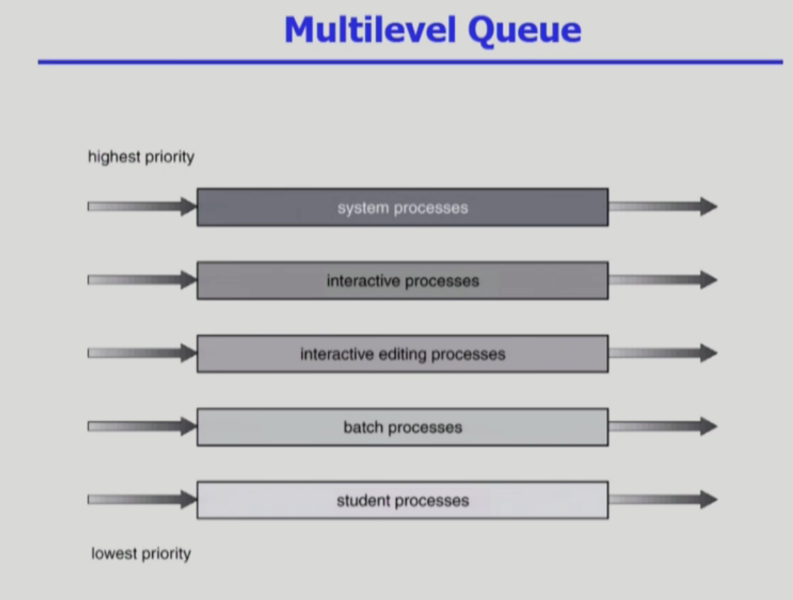
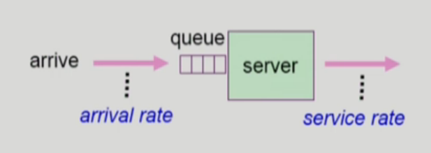
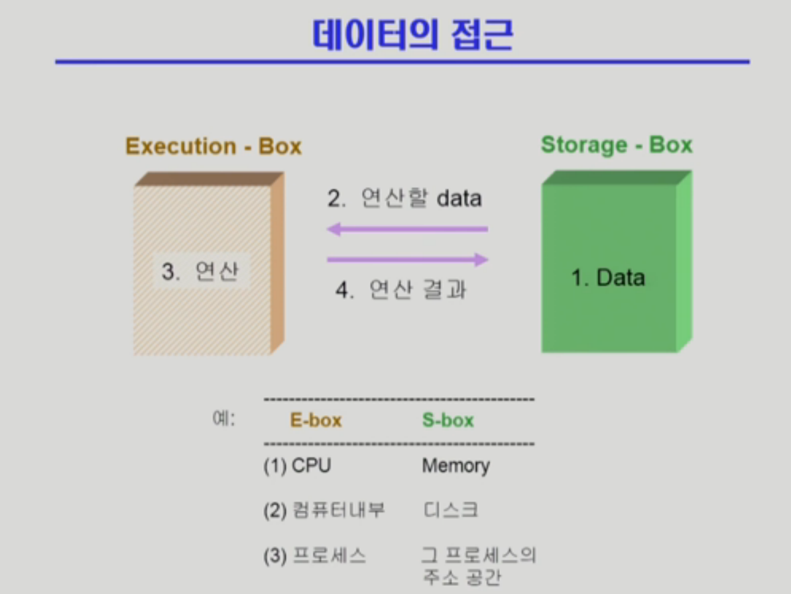
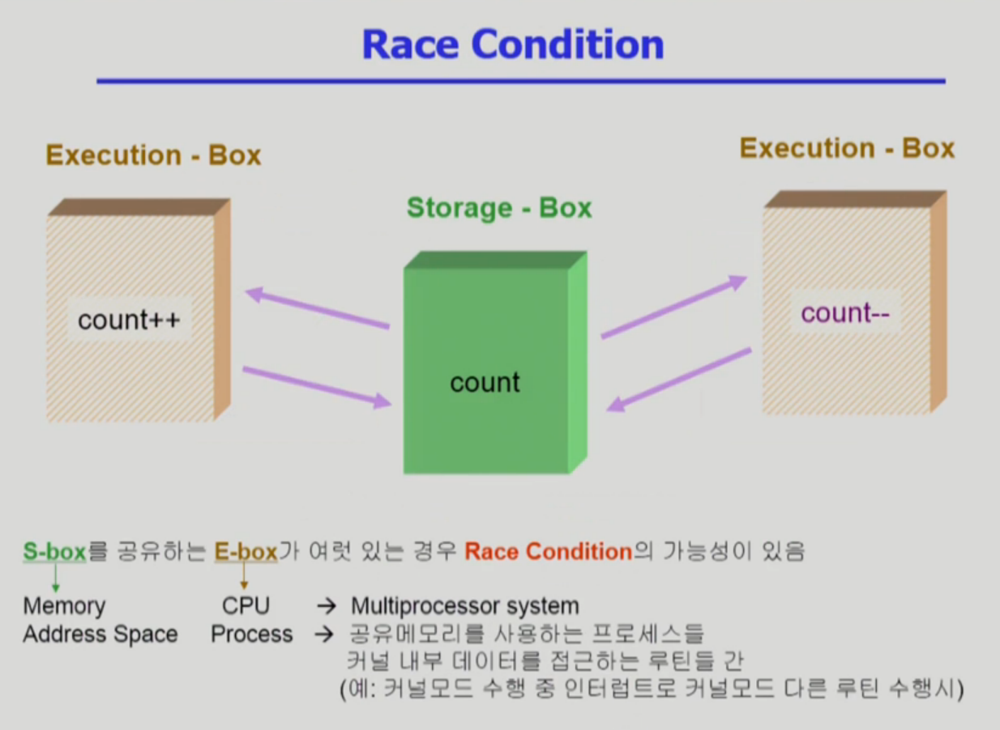
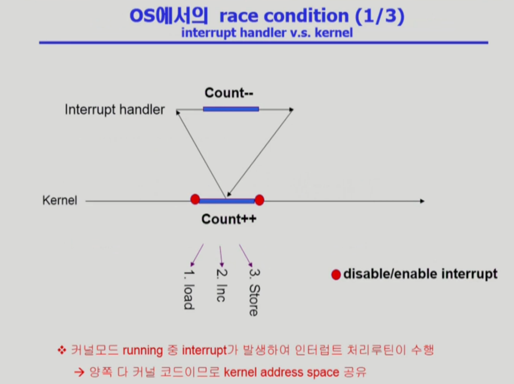
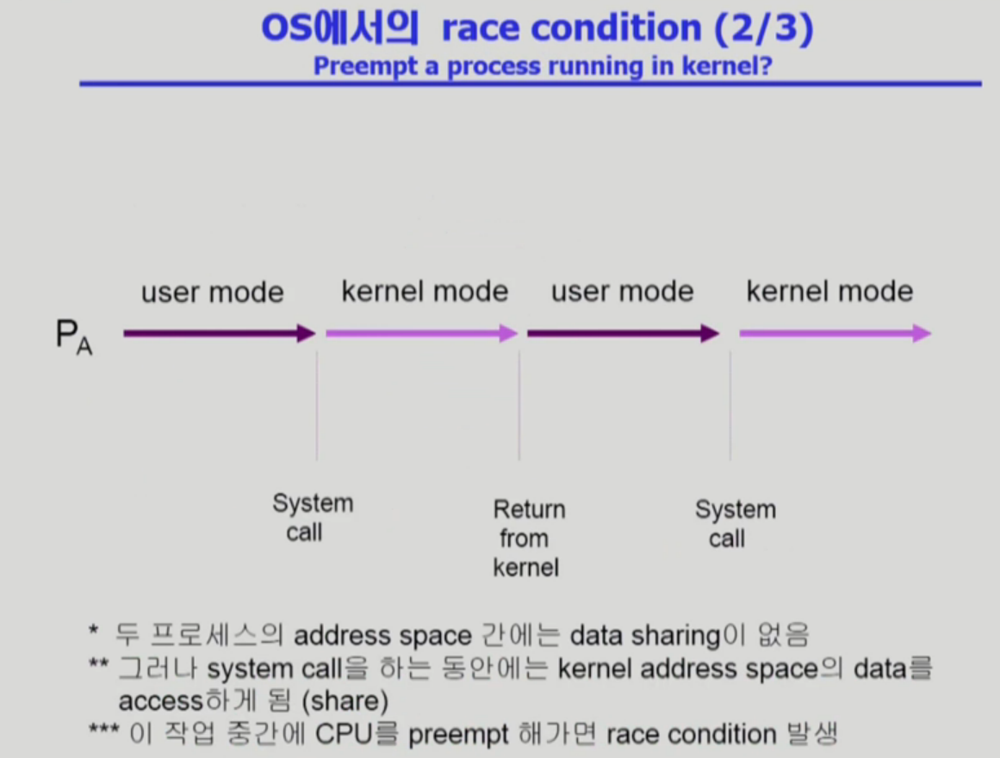
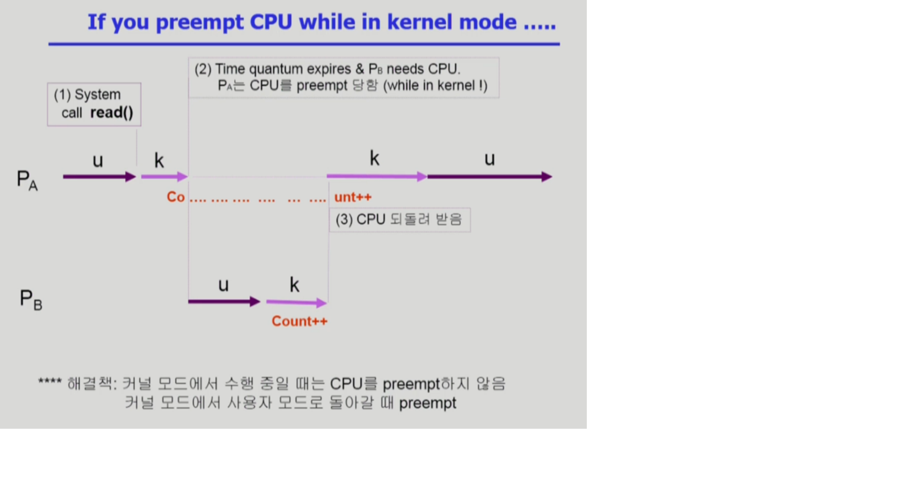
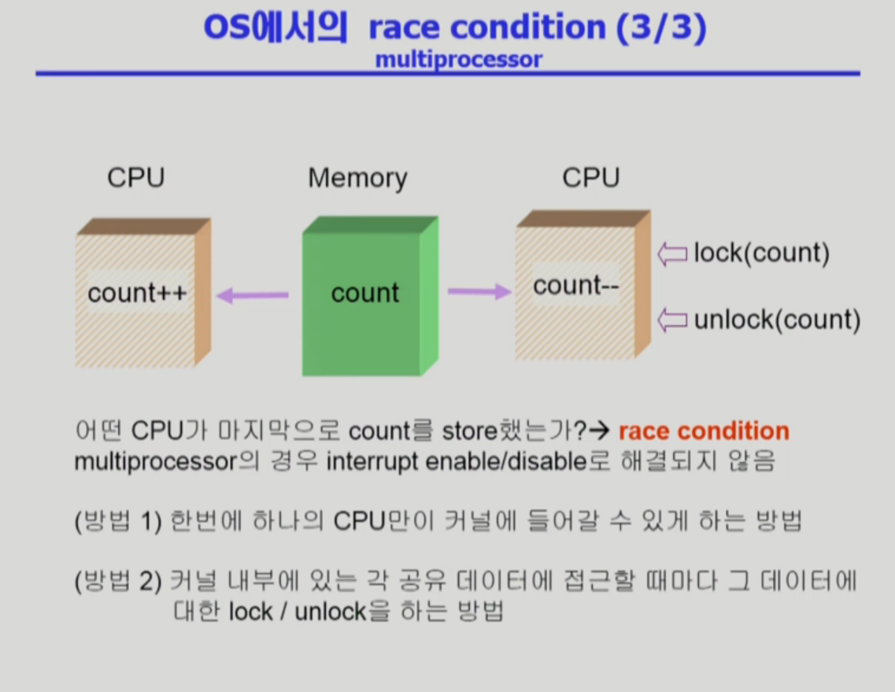
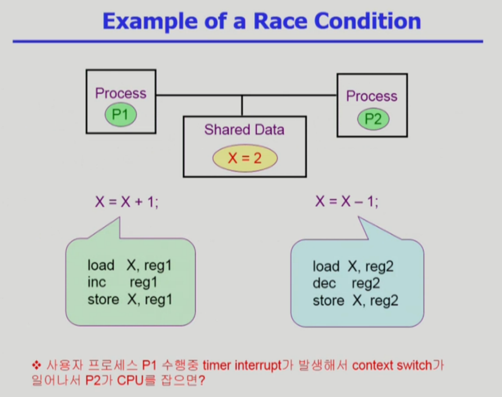
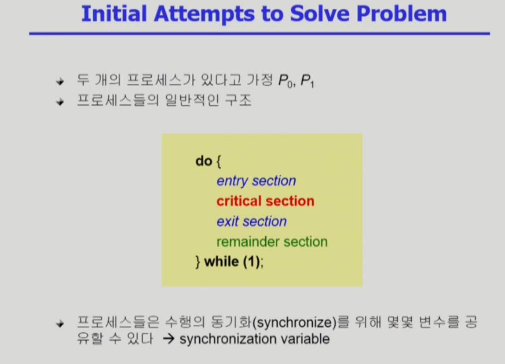

지난 시간에 이어 CPU 스케줄링을 계속 설명드리겠습니다.

(라운드로빈에 대한 설명)
이 라운드로빈의 좋은 이유는 바로 우리가 이 컨텍스트, 프로세스의 컨텍스트를 세이브하고. 그리고 다시 시피유를 얻었을 때는 그 지점부터 다시 재개할 수 있는 그런 매커니즘이 제공되기 때문에 가능했던거죠. 사람의 경우에도 그런게 되면 좋겠지만..

예를 들면, 은행에서도 이제 아주 계좌를 트는데 한 5분이면 되는 고객이 있고.. 뭔가 상담을 하면서 한시간씩 걸리는 고객이 있을 때 상담 하는 고객이 먼저 온 경우에는 계좌를 만드는데 5분이면 되는 고객이 오래 기다려야하죠.
그런데 이제 상담원이랑 고객이랑 협의가 되어서 상담을 한 5분정도 하고 저기 뒤에가서 줄서세요 하고 다른 사람 업무 처리해주고, 그럼 아까 만약에 상담한 시점으로 컨텍스트가 다시 시작이 될 수 있으면 그렇게 해도 되겠지만 사람은 그렇지가 못하죠. 다른걸 하고 있다보면 까먹어서 처음부터 다시 알려줘야하는 경우도 생기고.. 이런 경우에는 라운드로빈을 해도 효과를 별로 못보겠죠.
(잠시 다른 설명)

그래서 전 시간까지 라운드로빈 스케줄링을 말씀드렸고 오늘 말씀드릴 내용은 Ready Queue에.. 시피유를 기다리는 줄이죠. 그동안 이 줄을 한줄로 섰습니다.
이제 이 Multilevel 큐나 Multilevel Feedback Queue는 여러줄을 서게됩니다.

여기 보시면 이제 멀티레벨 큐에 여러 줄이 있는 모습을 보여드리고 있습니다. 맨 윗줄이 가상 우선순위가 높은 줄이 되겠고, 밑으로 내려갈 수록 우선순위가 낮은 줄입니다.

그래서 프로세스가 어떤줄을 서게되면, cpu가 여러개 있으면 모르겠지만 하나만 있다면 이 줄에서 어느 한 job만 빠져나와서 cpu의 서비스를 받을겁니다.
여길 보시면 우선순위가 다섯가지로 나뉘어져 있는데, 가장 높은 것은 시스템 프로세스라고 해서 시스템과 관련된 그런 프로세스들이 기다리고 있고.
그 다음이 이제 사람하고 인터랙션 하는 프로세스. 그 다음에는 인터랙션이 약간 떨어지는 프로세스가 있고.
그 다음이 배치 프로세스. 시피유만 오랫동안 사용하는 job들을 여기서는 배치 프로세스라고 했겠죠.

그리고 이 그림은 (공룡책)에서 가져온 이미지인데, 학생 프로세스가 제일 아래에 있습니다.

여기는 완전히 계급제입니다. 성골이 있고 진골이 있고 육두품, 노비.. 그래서 본인이 노비면 노비줄에 가서 서야합니다.

성골이 기다리고 있으면 성골한테 무조건 시피유가 가고, 성골 줄이 비면 진골한테, 진골도 없으면 육두품한테, 육두품도 없으면 노비한테 시피유가 갈 수 있는것이죠.

태어난 출신에 따라서.. 영원히 우선순위를 극복하지 못하는 이런 식의 스케줄링이 멀티레벨 큐 스케줄링이라는 것입니다.

그다음에 이제 멀티레벨 피드백 큐를 설명드릴건데, 여기도 줄이 여러개 있지만 현대 사회처럼 출신이 나빠도 중간에 출세를 할 수 있고
출신이 높아도 방탕하게 살다보면 내려가기도 하고.. 그런 식의 스케줄링이 피드백 큐 스케줄링입니다.

줄이 여러개 있는데 시피유는 하나밖에 없다면 고려해야될 사항이 몇가지 있겠죠. 먼저 프로세스를 어느줄에 넣을것인가, 그게 필요할것이고.

제가 아까 말씀드린대로 우선순위가 높은 줄이 비어있지 않으면 무조건 그 친구한테만 (그 줄에만) 우선권을 주느냐. 그러면 우선순위가 낮은 프로세스는 스타베이션을 겪을 수 있기 때문에 그런 문제를 해결하기 위한 방안도 설명되어 있습니다.

#### Multilevel Queue
* Ready Queue를 여러 개로 분할
    * foreground (interactive)
    * background (batch - no human interaction)
* 각 큐는 독립적인 스케줄링 알고리즘을 가짐
    * foreground - RR
    * background - FCFS
* 큐에 대한 스케줄링이 필요
    * Fixed priority scheduling
        * serve all from foreground then from background.
        * Possibility of starvation.
    * Time slice
        * 각 큐에 CPU time을 적절한 비율로 할당
        * Eg. 80% to foreground in RR, 20% to background in FCFS

여기 소개된 방식은, 큐가 두갭니다 지금. 포그라운드 큐, 백그라운드 큐. 이렇게 두줄 서기를 하고 있구요.
포그라운드에는 인터랙션을 하는 잡, 백그라운드에는 인터랙션이 없는 배치 잡.
그다음에 각 줄마다 스케줄링 하는 방식이 필요하겠죠.
만약 포그라운드에 줄 서있는 프로세스들이 있다면, 사람이랑 인터랙션을 하는 잡이기 때문에 라운드로빈이 응답시간을 짧게 하는데 유리하겠죠.
그리고 백그라운드에 있는 잡은 어차피 시피유만 오랫동안 쓸 프로세스고 응답시간이 짧다고 좋을게 없는거잖아요? 배치형 잡이니까
중간에 시피유를 얻었다 뺏었다 하면서 컨텍스트 오버헤드가 발생하는 일 없이 FCFS를 쓰는것이죠.

그다음에 인제 아까 말씀드렸던것처럼, 어떤 큐한테 시피유를 줄거냐. 두가지로 이루어지겠죠.
이번에 어느줄에 시피유를 줄지 결정하고, 그 다음에 그 줄에서 어떤 잡한테 시피유를 줄지 정해야겠죠.

스타베이션을 막기 위해서 각 줄마다 시피유 시간을 나눠서 주는 방법을 생각해볼 수 있습니다.
우선순위가 높은 줄에는 80%를 주고, 우선순위가 낮은 줄에는 20%를 주고.
그런식으로 하면 노비라 하더라도 최소한 굶어죽지는 않을 것이다라는 거죠.

그래서 이 방식은.. 차별적인거죠. (라운드로빈은 공정적이라고 했지만)
이 차별도 차별이지만 신분을 영원히 극복하지 못하는건 문제가 있다 그래서 멀티레벨 피드백 큐가 나온겁니다.

#### Multilevel Feedback Queue
* 프로세스가 다른 큐로 이동 가능
* 에이징(aging)을 이와 같은 방식으로 구현할 수 있다
* Multilevel-feedback-queue scheduler를 정의하는 파라미터들
    * Queue의 수
    * 각 큐의 Scheduling algorithm
    * Process를 상위 큐로 보내는 기준
    * Process를 하위 큐로 내쫓는 기준
    * 프로세스가 CPU 서비스를 받으려 할 때 들어갈 큐를 결정하는 기준

그래서 이런 멀티레벨 피드백 큐에서는, 큐를 몇개 둘거냐 하는 문제. 각 큐에서는 어떤 스케줄링을 사용할 것인가. 우선순위 상승/하락되는 기준을 어떻게 할것이냐.
그리고 처음 들어갈 때 어떤 큐로 들어갈 것이냐. 이런식으로 여러 기준이 정해져야된다는 것이죠.

보통은 이걸 어떤 식으로 운영하느냐 하면, 처음 들어온 프로세스는 우선순위가 가장 높은 큐에다 넣구요. 우선순위가 높은 큐는 라운드 로빈 스케줄링이 cpu 퀀텀을 아주 짧은 시간으로 할당해줍니다.
그리고 밑의 큐로 갈 수록 라운드로빈의 그 할당시간을 점점 길게 주고, 제일 아래는 FCFS 방식을 쓴다는 것이죠.

그렇게 하고 할당시간이 맨 위의 큐에서 끝나게 되면 그 아래큐로 강등이 되고, 또 그 아래큐에서도 할당시간내에 다 처리가 안됐으면 더 아래큐로 강등이 되고.. 이런 식으로 운영을 한다는거죠.

그래서 아주 cpu burst가 짧은 job은 들어와서 시피유 받자마자 바로 빠져나갈 수 있구요.
그리고 cpu burst가 긴 job은 맨 위의 큐에서 안끝나서 점점 내려가면서 할당시간을 더 받게 되겠지만, 보통 우선순위가 높은 큐가 비어있을 때만 아래 큐에서 시피유를 쓸 수 있게 되니까 작업이 끝나는데 오래걸리겠죠.

굉장히 이 방식은.. 시피유 사용 시간이 짧은 프로세스들에게 시피유를 많이 주게되는 스케줄링이라는 것이죠.

라운드로빈만으로도 부족하다는거죠 이게. cpu burst가 짧은 프로세스가 우선순위를 더 받고 이런게 잘 구현이 안되기 때문에, 멀티레벨 피드백 큐를 써서 시피유 사용시간이 짧은 프로세스에게 우선순위를 더 많이주고.. 긴 프로세스는 점점 더 밑으로 쫒겨나게해서 우선순위를 낮추고.

그리고 이 방식의 경우는 시피유 사용시간을 예측할 필요가 없겠죠. 그냥 처음에 들어올 땐 누구든지 짧은 시간을 주기 때문에 미리 예측도 필요없으면서 짧은 프로세스가 더 우대를 받는 그런 방식이 되겠습니다.
제가 말씀드린것처럼, 큐에 대한 스케줄링이 위로 갈수록 할당시간을 짧게 주고 밑으로 내려갈수록 FCFS를 쓰고, 그런식으로 운영한다는 것이죠.

#### Example of Multilevel Feedback Queue
* Three Queues:
    * Q0 - time quantum 8 ms
    * Q1 - time quantum 16 ms
    * Q2 - FCFS
* Scheduling
    * new job이 queue Q0로 들어감
    * CPU를 잡아서 할당 시간 8 ms 동안 수행됨
    * 8 ms동안 다 끝내지 못했으면 queue Q1으로 내려감
    * Q1에 줄서서 기다렸다가 CPU를 잡아서 16 ms 동안 수행됨
    * 16 ms에 끝내지 못한 경우, queue Q2로 쫓겨남

그래서 지금까지 말씀드린 시피유 스케줄링은 시피유가 하나밖에 없는 그런 시스템이었죠. 지금부터 말씀드릴것은 시피유가 여러개이거나, 또는 시간에 대한 데드라인 제약조건이 있거나
또는 스레드가 여러개 있거나. 이런식으로 특이 케이스에 대한 시피유 스케줄링을 말씀드릴겁니다.

먼저 시피유가 여러개 있는 경우에서의 스케줄링입니다. 복잡하게 생각할 필요 없습니다.
시피유가 여러개 있으면 뭐가 다를까요? 화장실이 한칸 있던게 여러칸으로 늘어난 것 뿐이죠.
은행에서 직원이 한명 있다가 여러명으로 늘어난거죠.

#### Multiple-Processor Scheduling
* CPU가 여러 개인 경우 스케줄링은 더욱 복잡해짐
* Homogeneous Processor인 경우
    * Queue에 한줄로 세워서 각 프로세서가 알아서 꺼내가게 할 수 있다.
    * 반드시 특정 프로세서에서 수행되어야 하는 프로세스가 있는 경우에는 문제가 더 복잡해짐
* Load Sharing
    * 일부 프로세서에 job이 몰리지 않도록 부하를 적절히 공유하는 매커니즘 필요
    * 별개의 큐를 두는 방법 vs 공동 큐를 사용하는 방법
* Symmetric Multiprocessing (SMP)
    * 각 프로세서가 각자 알아서 스케줄링 결정
* Asymmetric Multiprocessing
    * 하나의 프로세서가 시스템 데이터의 접근과 공유를 책임지고 나머지 프로세서는 거기에 따름

그래서 이렇게 한줄 서기로 처리할 수도 있을거고, 어떤 경우에는 특정 프로세서가 수행해야하는 프로세스가 있을겁니다.
이런건 어떤 경우가 있을까요? 뭐 예를 들면, 머리 깎으러 가는데, 이제 헤어디자이너가 여러명 있죠.
먼저온 순서대로 머리를 할 수도 있지만 저를 전담해주는 선생님이 있죠. 그 선생님한테 깎겠다 그러면 그게 특정 프로세서가 수행해야하는 잡인거죠.

이제 그런걸 나름 고려해서 스케줄링을 하겠죠. 컴퓨터에서도 마찬가지입니다.
시피유가 여러개 있는데 특정 프로세스는 특정 프로세서에서 실행하겠다 했을 때 그거를 할당해놓고 또 스케줄링을 하고. 이런 식으로 해야된다는 것이죠.

(잠시 다른 이야기)
시피유가 이렇게 여러개가 있으면 로드 쉐어링이 중요하겠죠.
특정 시피유만 일하고, 나머지 시피유는 놀고 있고 그러면 안되겠죠. 그러므로 부하를 적절히 조절할 수 있는 로드 쉐어링을 할 필요가 있는데..
아까 시피유가 여러개 있는데도 한줄 서기를 한다고 말씀드렸습니다. 근데 꼭 한줄 서기를 할 필요는 없고, 각각의 시피유마다 별도의 줄을 서게 하는 방법도 있을수가 있죠.
우리가 화장실에서도 한줄 서기를 하지만, 화장실 칸마다 줄서서 기다릴수도 있고 그렇죠.
그러므로 우리는 줄을 잘서야 합니다. 어떤 줄에서는 빨리 끝나고, 어떤 줄에서는 오래 끝나고. 컴퓨터 세계에서는 그렇게까지는 아닐거에요. 라운드로빈이 있으니까.

그다음에 이 시피유가 여러개 있는 시스템에서, SMP라는 방식이 있고 Asymmetric한 멀티프로세싱을 할 수 있는 방법이 있습니다. 시미트릭이라는건 모두 대등한겁니다.
각 시피유가 알아서 스케줄링하는 경우를 얘기하는거구요. 어시미트릭한거는 시피유 하나가 전체적인 컨트롤을 담당하는겁니다. 데이터 접근이나 공유를 담당하고, 나머지 시피유는 거기에 따르는 방법이죠.
우리가 공항에 가서 짐을 부칠때 보면, 짐부치는 사람만 있는게 아니라 사람이 하나 서가지고 저쪽으로 가세요~ 이쪽으로 가세요~ 하잖아요.
어시미트릭은 시피유 하나가 이 역할을 전담하는겁니다.

#### Real-Time Scheduling
* Hard real-time systems
    * Hard real-time task는 정해진 시간 안에 반드시 끝내도록 스케줄링해야 함
* Soft real-time computing
    * Soft real-time task는 일반 프로세스에 비해 높은 priority를 갖도록 해야 함

그다음에 리얼 타임 스케줄링에 대해 말씀드리겠습니다. 이미 말씀드렸다시피 리얼 타임 잡이라는거는 어떤 데드라인이 있는 잡이죠. 정해진 시간안에 반드시 실행이 되어야만 하는 그런 걸 리얼타임잡이라고 말씀드렸습니다.
그래서 시피유 스케줄링 할때도 리얼타임 잡은, 반드시 데드라인을 보장해줘야겠죠. 먼저 시피유를 주고 이런게 중요한게 아니라 이 리얼타임 태스크는 데드라인 안에 작업이 끝나는걸 보장해야되는데..

리얼 타임 스케줄링은 그때그때 스케줄링을 하기보다는 그걸 미리 스케줄링을 해서 데드라인을 보장하도록 적재적소에 배정하는 그런 방법을 쓰고 있습니다.
이런식으로 우리가 타임 쉐어링 시스템, 여러 프로세스가 존재하는 시스템보다 원래 리얼타임 시스템이라는거는.. 그 본연의 업무에 해당하는 잡이 있고
그 데드라인이 여기다 그러면, 그 이내에 처리가 되도록 맞춰지게 잡을 배치하는 방법을 쓴다는 것이죠.
반드시 데드라인을 보장해줘야 할때는 오프라인으로 미리 스케줄링을 해놓거나, 또는 이런 잡들이 피리어틱한 성질을 갖는 경우가 많습니다.
주기적으로 액티베이트가 되어야 하는. 1초에 한번씩이라든지. 또는 10초에 한번씩 시피유를 잡아서 적어도 1초동안 시피유를 써야한다는 제약조건이 있으면..
10초안에는 그 1초가 아무데나 들어가도 상관없겠죠. 그런데 적어도 그 10초동안 한번은 1초를 보장받아야 하고.

그렇게 반드시 보장받아야 하는 것을 우리가 하드 리얼타임 시스템이라고 하고, 최근에는 소프트 리얼타임이라고 해서 일반적인 타임쉐어링 시스템에서 다른 프로세스들하고 섞여서 실행되는 것들이 있죠.
예를 들면 영화를 본다던지, 이런게 데드라인이 있다고 해도 그걸 꼭 지켜야하는건 아닙니다. 조금 어겨도 어쩔 수 없는 그런 시스템들이죠.
그런 시스템들에서는 데드라인을 반드시 지키는것보다는, 다른 프로세스들도 많이 존재하기 때문에 이런 소프트 리얼타임 태스크는 다른 우선순위만 높여줘서 시피유를 먼저 얻을 수 있게 하지.. 데드라인을 꼭 보장하지는 못하고. 이런 식의 방법도 많이 쓰고 있다는거죠.

#### Thread Scheduling
* Local Scheduling
    * User level thread의 경우 사용자 수준의 thread library에 의해 어떤 thread를 스케줄할지 결정
* Global Scheduling
    * Kernel level thread의 경우 일반 프로세스와 마찬가지로 커널의 단기 스케줄러가 어떤 thread를 스케줄할지 결정

그다음에는 쓰레드 스케줄링입니다. 전 챕터에서 스레드에 대해 설명 드렸었습니다. 프로세스 하나 안의 시피유 수행단위가 여러개 있는 그런걸 우리가 스레드라고 말씀드렸었죠. 그래서 스레드를 구현하는 방식이 크게 두종류가 있었습니다.
바로 유저 레벨 스레드라고 해서 사용자 프로세스가 직접 스레드를 관리하고, 운영체제가 그 스레드의 존재를 모르는 경우.
커널 레벨 스레드는 운영체제가 그 스레드의 존재를 이미 알고 있는 경우.

각 상황에 따라서 스케줄링 하는 방법도 다릅니다. 이 유저레벨 스레드의 경우는 운영체제가 이 스레드를 모르기 때문에.. 프로세스한테 언제 시피유 줄지만 정하는거고.
그 프로세스한테 시피유가 갔을때 이제 프로세스 내부에서 어떤 스레드에 시피유가 갈지 정하는거죠.
반면에 커널 레벨 스레드의 경우는 어차피 운영체제가 스레드의 존재를 알고 있기 때문에 프로세스 스케줄링 하듯이 운영체제가
이제 어떤 알고리즘에 근거해서 이번에 어떤 스레드에게 시피유를 줄지를 결정하는거죠. 그런걸 우리가 글로벌 스케줄링이라고 부르는 것입니다.

#### Algorithm Evaluation
* Queueing models
    * 확률 분포로 주어지는 arrival rate와 service rate 등을 통해 각종 performance index 값을 계산
* Implementation (구현) & Measurement (성능 측정)
    * 실제 시스템에 알고리즘을 구현하여 실제 작업(workload)에 대해서 성능을 측정 비교
* Simulation (모의 실험)
    * 알고리즘을 모의 프로그램으로 작성 후 trace를 입력으로 하여 결과 비교

지금까지 시피유 스케줄링 알고리즘들을 여러가지 설명 드렸고, 그다음에 그 알고리즘에 대한 성능 척도도 설명을 드렸죠. 그렇다면 그 어떤 알고리즘이 좋은지를 평가할 수 있는 방법이 필요하겠죠.
그 방법에 대해서 지금 이제 설명을 드릴겁니다. 어떤 알고리즘이 좋은지를 평가할 수 있는 방법.. 크게 세가지로 나눌 수 있습니다.

첫번째는 큐잉 모델인데요. 이건 굉장히 이론적인 방법입니다. 여기 보시면 그림이 있죠.

이 큐에, 잡들이 도착을 합니다. 도착해서 쌓이게 되고. 여기는 이제 서버라고 표현을 했는데 보통 큐잉 모델에서는 서버라고 부르지만.. 우린 시피유 스케줄링을 하고 있기 때문에 여기선 서버가 시피유가 되겠죠.

그리고 시피유 능력에 따라서 처리를 하고 빠져나가고, 그런거에 대한 서비스 레이트 (처리율) 있겠죠. 얼마나 도착했는지에 대한 비율 (arrival rate)이 있겠고.
큐잉 모델은 이제 이런 rate가 확률 분포로 주어질 때 복잡한 수식 계산을 합니다. 그다음에 성능 척도 결과가 나옵니다.
시피유의 스루풋이 단위당 몇개씩 처리하는지. 잡들이 평균적으로 얼마 기다렸는지. 계산에 의해서 나온다는거죠.

예전에는 이런 방식을 굉장히 많이 썼었는데, 최근에는 실제 시스템에서 돌려보는 방식을 더 의미있게 보기 때문에 그렇게 많이 쓰진 않지만 여전히 이론적으로는 많이 사용하는 방법중 하나입니다.

그거랑 완전히 상반되는 것이 두번째에 나오는 구현 & 성능 측정 방식입니다.
이거는 시스템에다가 구현을 해서, 정말로 돌려보고 성능을 측정하는겁니다. 예를 들자면 제가 시피유 스케줄링을 하나 새로 만들었어요. 그러면, 그 알고리즘이 좋은지를 어떻게 평가하느냐.
실제 시스템에 구현하는겁니다. 리눅스가 있으면 그 리눅스에 원래 있는 시피유 스케줄러가 있겠죠. 그 시스템하고, 그다음에 내가 만든 스케줄링 알고리즘을 리눅스 커널 소스 코드를 수정해서 새로운 알고리즘을 구현한 다음에 리눅스 커널을 컴파일하면 리눅스 실행 바이너리가 나오게 되겠죠.
그럼 기존 리눅스 커널을 설치한 PC하고 내 알고리즘을 넣고 컴파일한 커널을 설치한 PC하고 컴퓨터 두대가 있겠죠.
그리고 실제 프로그램 (워크로드) 돌려서 어느쪽이 빨리 끝나는가를 보면, '아 이게 더 빠른 스케줄링 방식이구나'라는 걸 알 수 있겠죠.

이 방법은 특히 이제... 운영체제를 직접 고치는건 쉬운 일이 아니겠죠. 이런 방법을 쓰기 어려우면 좀 더 쉽게 쓸 수 있는 방법이 세 번째 나와있는 시뮬레이션이 되겠습니다.
이 시뮬레이션이라는건 모의실험을 한다고 되어있는데, 예를 들자면 앞에서 SJF 스케줄링이 어떤 성능을 내는지 확인하기 위해서 이런 예제가 있죠.
프로세스 네개의 도착 시간이랑 시피유 쓰고자 하는 시간이 어떤지 정해져있을 때, 그걸 계산해서 어떤 결과가 나오는지 보고.

이렇게 간단한 예에서는 손으로 직접 계산해보지만 복잡해진다고 생각해봅시다. 그거를 대신하는 프로그램을 하나 짜면 그게 시뮬레이션 프로그램이고, 그걸 돌려보면 결과가 나오게 되겠죠.

(시뮬레이션을 어떻게 해야되는지에 대한 설명)

--------------

이제 6장, 프로세스 싱크로나이제이션에 대해서 설명드리려고 합니다.

이 컴퓨터 시스템 안에서 데이터가 접근되는 패턴에 대해서 먼저 설명드릴겁니다. 컴퓨터 시스템 안의 어떤 위치에 있던 간에, 데이터를 접근하는거는 요런 경로를 통하게 되어있습니다.
어떤 데이터가 저장된 위치가 있을거구요. 그걸 읽어와서 연산을 보통해서 그 연산된 결과를 원래 위치에다가 다시 저장을 하는..
데이터가 저장되어있는 위치를 추상적으로 스토리지 박스라고 그냥 이름을 붙인거구요. 그다음에 실제로 연산을 하는 부분을 익스큐션 박스라고 이름을 붙였습니다.

데이터가 저장된 위치에서 읽어와서 연산을 하고 원래 위치에 다시 반영을 하고 그러기 때문에, 프로세스 싱크로나이제이션이라는 문제가 발생하게 되는겁니다.

데이터를 읽기만 하면 누가 먼저 읽든 별로 문제가 될게 없습니다. 그런데 데이터를 이런식으로 읽어와서 연산을 하고 수정한다음에 결과를 다시 저장하는 이런 방식에서는.. 누가 먼저 읽어갔느냐에 따라서 결과가 달라질수도 있고..
그렇게 해서 생기는 문제를 이 챕터에서 소개해드리게 되는겁니다.

다음 슬라이드에 보시면 이런식으로 이 스토리지 박스를 이 친구 혼자 사용한다고 하면 문제가 될게 없습니다.

그런데, 이런 식으로 이 스토리지 박스를 여러 익스큐션 박스가 공유한다고 하면 어떤 문제가 생기느냐. 이 친구가 이 데이터를 읽어가서 1 증가시키려고 하는 것이고, 반대로 이 친구나 이 데이터를 읽어가서 1 감소시키려고 하는겁니다.
근데 1 증가시키고 하나 더하고 하나 빼고하면 결과가 어떻게 되나요? 그냥 원래값이 되겠죠.
그런데, 이 친구가 가져가서 1 증가시키는동안에 저 친구가 그 데이터를 또 읽어간겁니다.

그런 상황에서, 이 친구가 연산을 다 끝내서 저장을 하고. 그 다음에 저 친구가 1빼는 연산을 끝내고 저장을 하고. 그럼 결과가 어떻게 될까요?
1 더하고 1 뺐는데 불구하고 더한거는 반영이 안되고, 더하기 전의 데이터를 이 친구가 읽어간다음에 뺀 연산 결과를 저장했기 때문에 1 뺀 결과만 저장이 되겠죠.
이게 바로 싱크로나이제이션에 관련된 문제입니다. 여러 주체가 하나의 데이터를 동시에 접근 할 때 이걸 레이스 컨디션이라고 부릅니다. 경쟁 상태.
이 경쟁 상태를 조율해주는 방법이 필요하겠다는 겁니다.
그런데 이런 문제가 컴퓨터 시스템에서 많이 발생 할 수 있는지 여러분에게 의문이 생길겁니다.

사실 이런 문제는 여러 곳에서 발생할 수 있습니다. 주체를 시피유라고 보고, 저장되어있는 곳을 메모리라고 봤을 때 시피유로 데이터를 읽어들여서 다시 메모리에 저장을 하고.
그다음에 이 연산하는 곳을 컴퓨터라고 하면 저장되는 곳은 IO장치. 하드 디스크라고 생각할 수 있겠죠. 하드 디스크에 있는걸 컴퓨터에 인풋해서 결과를 다시 아웃풋으로 보내서 스토리지에 저장하고.
이런 하드웨어적인거 말고 완전히 생각을 다르게 해서 이렇게 생각할 수도 있습니다. 프로세스가 연산의 주체고, 그 프로세스가 관리하는 메모리 주소 공간. 이게 저장되어있는 위치겠죠.
그러면 프로세스는 보통 실행을 하면서, 자기 주소 공간에 있는 데이터를 읽어다가 뭔가 연산을 하고.. 그 결과를 다시 자기 주소 공간에 쓰겠죠.

우리가 시피유가 하나밖에 없는 시스템에서는 어차피 하나의 시피유가 메모리를 접근하는거기 때문에 다음페이지에 나오는 그런 문제가 발생 안할 것 같죠.
그리고 프로세스가 각자 자기꺼의 주소 공간만 볼 수 있었죠. 각자꺼만 접근하기 때문에 여기서도 그런 문제가 생기지 않을것 같은데...
그런데 이제 굳이 그런 문제가 생기는 사례를 들어보자면, 멀티 프로세서 시스템에서 만약에 메모리를 공유하고 있다면 이런 문제가 생길 수 있겠죠.

하나의 시피유가 메모리에 있는 데이터를 읽어간 동안에, 다른 시피유에서도 그 데이터를 읽어가면 이 레이스 컨디션 문제가 생길 수 있을겁니다.
또, 프로세스는 자기 자신의 주소 공간만을 접근 할 수 있지만.. 공유 메모리를 사용할 수 있는 방법이 있다고 했었죠.
(9강 - 프로세스 협력)

더 중요한 문제는 바로 운영체제 커널과 관련되어서 생기는 문제들입니다. 우리가 프로세스는 일반적인 경우라면 자기 주소 공간만 접근하기 때문에 이런 레이스 컨디션, 프로세스 싱크로나이제이션과 관련된 문제가 발생할 수 없습니다. 그런데 프로세스가 본인이 직접 실행할 수 없는 부분. 즉 운영체제에게 실행을 요청해야할때 시스템 콜을 한다고 했죠.
커널이 프로세스를 대신해서 실행하고, 그러면 커널에 있는 데이터나 변수값을 접근하는겁니다. 그래서 작업하다가 시피유를 뺏겨서 다른 프로세스한테 넘어갔는데 그 프로세스도 시스템콜을 해서 커널의 코드가 실행되면 문제가 발생할 수 있겠죠. 이런 경우에 레이스 컨디션 문제가 발생할 수 있습니다.

실행중인데 인터럽트가 들어올수도 있습니다. 프로세스가 커널의 데이터를 건드리는도중에 인터럽트가 들어오면 지금 하고 있는 일은 잠시 잊고 인터럽트 처리하는 코드를 실행할텐데. 그것도 커널 코드기 때문에 문제가 생길 수 있는거죠.
유저 레벨에서는 별 문제 안되던것이 커널에서는 문제가 생길 수 있다는 겁니다.

#### OS에서 Race condition은 언제 발생하는가?
* Kernel 수행 중 인터럽트 발생 시
* Process가 system call을 하여 kernel mode로 수행 중인데 context switch가 일어나는 경우
* Multiprocessor에서 shared memory 내의 kernel data

그래서 운영체제에서 이 레이스 컨디션이 발생해서 문제가 생기는 경우를 크게 세가지 소개해드릴건데요.
제가 지금 말로 설명드린 것을 그림으로 표현해놓은겁니다.

그냥 예제니까 너무 어렵게 받아들이실 필요는 없는데요.
일단 운영체제 커널이 지금 시피유에서 실행을 하고 있습니다. 하고 있으면서, 어떤 count라는 변수의 값을 1 증가시키고 있었어요.
근데 보통 이런 고급 언어로 된.. 문장이 시피유 내부에서는 여러개의 인스트럭션을 통해서 실행이 되죠.

count라는 메모리 변수값을 1 증가시킨다 그러면, 이 메모리에 있는 변수 값을 시피유 안에 있는 레지스터로 불러들이고, 그 레지스터 값을 1증가시키고, 이 레지스터 값을 다시 메모리에 가져다 쓰고.
그렇게 여러개의 인스트럭션으로 나뉘어서 실행되죠.

문제는 요 변수를 레지스터로 읽어들인 상태에서 인터럽트가 들어왔을 때, 요 작업을 잠시 멈추고 인터럽트 처리 루틴으로 넘어가겠죠. 그게 위에 있는 이겁니다. 인터럽트 핸들러.
사실 인터럽트 핸들러도 커널에 있는 코드죠. 이 핸들러가 처리되는 도중에, 이게 커널 코드니까 커널에 있는 데이터인 count를 1 뺄 수 있겠죠. 그러고나서 인터럽트로 끝나고 원래 상태 되돌아오게 될텐데.
컨텍스트 저장할 때 메모리 변수를 시피유 내부로 읽어들이는데까진 해놨으니까 여기선 1 증가시킨다음에 저장만 하겠죠.

그런데, 앞의 예제랑 똑같게 1 감소시키고 1증가시켰기 때문에 count 변수는 원래값하고 똑같아야 될겁니다. 결과적으로는 1 감소 시킨게 반영이 안되고, 1 감소 시키기전의 값을 레지스터에 저장해뒀다가 증가했기 때문에 1 증가만 반영이 된다는겁니다.

이 문제를 해결하기 위해서 어떤 방법을 쓰냐면, 이렇게 중요한 변수 값을 건드리는 동안에는 인터럽트가 들어와도 인터럽트 처리 루틴으로 넘기는게 아니라 이 작업이 끝날때까지 인터럽트 처리를 안하는겁니다.
인터럽트를 disable 시켰다가, 이러한 작업이 끝날 때 인터럽트 처리 루틴으로 넘겨서 레이스 컨디션의 문제가 발생하지 않게.. 이런 방법으로 문제를 해결하고 있다는것이죠.

결국에는 순서를 정해주면 되어요. 어떤 친구 일하고 있는 동안에 다른 친구가 데이터 못가져가게 막으면 되는겁니다. 근데 무작정 막다보면 비효율적으로 될 수 있기 때문에 그걸 어떻게 처리하는지 예제와 설명을 드리고 있는겁니다.

두번째 예제입니다. 이미 설명 드렸던 부분인데..

어떤 프로세스가 실행이 된다는게 본인의 코드만 실행이 되는게 아니라 시스템 콜을 통해서 운영체제에게 서비스를 대신해달라고 요청하는 경우가 많이 있죠. 그래서 프로그램은 유저 모드와 커널 모드를 번갈아가면서 실행하게 되는데..

이 때 이 친구가 시피유를 독점적으로 쓰는게 아니라 할당 시간이 있고, 그 할당 시간이 끝나면 시피유를 반납하게 되어있죠. 예를 들자면 이 A라는 프로그램이 시피유를 잡고 쓰고 있다가 본인의 할당시간이 끝나서
시피유가 지금 B한테 넘어간겁니다. 그래서 B가 쓰다가 본인의 할당 시간이 끝나서 다시 A한테 시피유가 넘어온 이런 경우를 보여드린겁니다.

그런데, 이 할당 시간이 끝난 시점이 유저 레벨에 있다가 컨텍스트 스위치가 발생했으면 상관없는데 본인의 코드를 실행하다가 시스템 콜을 했습니다.
커널한테 뭔가 요청을 해서.. 커널의 코드가 실행중이고, 커널의 코드가 실행하면서 거기 있는 count라는 데이터값을 1 증가시키고 있는 도중이었어요.
그런데 그 상황에서 이 친구한테 할당된 시간이 끝난거죠. 시피유가 B한테 넘어간것이구요.

B가 또 본인 코드를 실행하다가, 커널이 처리해줘야되는 코드가 있어서 커널한테 대신해달라고 요청했는데 커널에서 또 count라는 변수를 건드려서 1증가시키는 작업을 한겁니다.
그다음 할당 시간이 끝나서 A한테 넘어왔죠. 그럼 A는 아까 하던 작업의 다음 인스트럭션을 실행하겠죠.

이 예제에 따르면 count가 2 증가해야되는데, 밑에서 증가한거는 반영이 안되겠죠. 왜냐면 증가 되기전의 count값을 읽어들였고, 그 컨텍스트를 가지고 1 증가 시킨다음에 저장했기 때문에.
여기서도 이렇게 싱크로나이제이션에 대한 문제가 발생한겁니다.

타임 쉐어링 환경에서 이런 문제를 해결하는 방법은.. 어떤 프로세스가 커널 모드에 있을 때는 할당 시간이 끝나도 CPU를 뺏기지 않도록 하는겁니다.
지금 이런 작업이 진행중인데, 진행 도중에 시피유를 뺏는게 아니라 커널 모드가 끝나고 유저 모드로 빠져나올 때 시피유를 빼앗는겁니다.

그럼 할당 시간이 정확하게 지켜지진 않겠죠. 약간의 편차가 생길 순 있을겁니다.
그렇지만 어차피 타임 쉐어링 시스템이라는거는, 리얼 타임 시스템이 아니에요. 조금 시간이 더 갔다고 해서 시스템에 큰 문제가 생기는 그런 시스템이 아니기 때문에 오히려 이런 문제를 쉽게 해결할 수 있다는거죠.

커널 모드에서 진행중일 때는 타임퀀텀이 끝났지만 잠시 유보를 해서 시피유를 뺏지 않고.. 이런 복잡한 문제를 쉽게 해결할 수 있다는겁니다.
그게 이제 두번째 예제로 소개해드렸고, 이제 마지막 예제는..

시피유가 여러개 있는 환경입니다. 요런 환경이 이 수업에서 자주 등장하는 경우는 아닌데, 이 예제 같은 경우는 앞에서 말한 그 어떤 방법으로도 해결이 안됩니다.

즉, 이런 작업이 진행되는 동안에 (공유데이터 건드리는동안) 인터럽트 막아서 해결 할 수 있느냐. 아니죠. 이 시피유에서 데이터 읽어서 작업하는 도중에 인터럽트 막는다고 해서 그 친구가 데이터 읽어갈 수 없는게 아니죠.

아까 문제는 도중에 시피유가 넘어갔기 때문에 발생하는 것이고, 이건 주체가 여러개이기 때문에 발생하는겁니다.

그래서 시피유가 여러개 있는 환경에서는 레이스 컨디션을 어떻게 막아야 하느냐. 이 데이터가 접근할 때 락을 걸어야 합니다.

즉, 이 친구가 이 시피유가 이 데이터를 들고 가서 수정을 하겠죠. 근데 수정하기 전에 이 데이터에 대해서 락을 걸어서.. 다른 어느 누구도 여기에 접근 못하게 해놓고 데이터를 변경하고 저장하고.

끝났으면 락을 풀어서 다른 시피유가 그 데이터를 접근할 수 있도록 그렇게 한다는거죠. 우리가 락을 걸고 푼다는거에 대해서 소프트웨어적으로도 방법이 있는데, 다음 시간부터 이런 설명을 드릴거구요.

이런 개별 변수에 대해서 락을 걸었다가 풀어줄 수도 있고 또 좀 더 쉽게 만들려면...

결국 이런 문제가 생기는 이유는 사용자 프로그램이 아니고 운영체제 커널을 여러 시피유가 동시에 접근하기 때문에 생긴 문제죠.
그래서 커널이 접근하는 시피유를 매 순간 하나만 접근할 수 있도록 하면 되겠죠.

커널 전체를 하나의 락으로 막고, 또 커널을 빠져나올 때 락을 풀어주는 것이 방법1이라는거죠.

이 방법을 쓰면 시피유가 여러개더라도, 커널 접근할 수 있는건 매 순간 하나밖에 없어서 비효율적이 되겠죠. 그래서 이 방법보다는 데이터별로 락을 걸었다가 푸는 방법(방법2)을 통해서 하는게 더 좋겠다는 것이죠.

지금부터는 이제 프로세스 싱크로나이제이션 문제에 대해서 다시 설명을 드릴겁니다.

#### Process Synchronization 문제
* 공유 데이터 (shared data)의 동시 접근(concurrent access)은 데이터의 불일치 문제(inconsistency)를 발생시킬 수 있다
* 일관성(consistency) 유지를 위해서는 협력 프로세스(cooperating process) 간의 실행 순서(orderly execution)를 정해주는 메커니즘 필요

* Race condition
    * 여러 프로세스들이 동시에 공유 데이터를 접근하는 상황
    * 데이터의 최종 연산 결과는 마지막에 그 데이터를 다룬 프로세스에 따라 달라짐

* Race condition을 막기 위해서는 concurrent process는 동기화(synchronize) 되어야 한다.

(잠시 예제 그림 설명)

#### The Critical-Section Problem
* n개의 프로세스가 공유 데이터를 동시에 사용하기를 원하는 경우
* 각 프로세스의 code segment에는 공유 데이터를 접근하는 코드인 critical section이 존재
* Problem
    * 하나의 프로세스가 critical section에 있을 때 다른 모든 프로세스는 critical section에 들어갈 수 없어야 한다

여러가지 용어가 있는데 그중에서 크리티컬 섹션이라는 용어가 나옵니다. 우리말로는 임계 구역이라고 하는데..

이 예제에서 공유 데이터가 있고, 프로세스 A는 공유 데이터에 있는 x를 1 증가 / 프로세스 B는 x를 1 감소 시키려는 상황이 있습니다.

이 때 크리티컬 섹션은 공유 데이터를 접근하는 코드, 즉 여기가 크리티컬 섹션이라는거죠.

프로세스 A가 크리티컬 섹션에 접근중인 상태에서 시피유가 넘어가더라도 다른 프로세스가 들어가지 못하게 한다는것이죠.

크리티컬 섹션에서 빠져나와서 공유 데이터 접근이 자유로워졌을때, 그때서야 이 프로세스가 접근할 수 있다는 것이구요.

### 프로그램적 해결법의 충족 조건
* Mutual Exclusion
    * 프로세스 Pi가 critical section 부분을 수행 중이면 다른 모든 프로세스들은 그들의 critical section에 들어가면 안 된다
* Progress
    * 아무도 critical section에 있지 않은 상태에서 critical section에 들어가고자 하는 프로세스가 있으면 critical section에 들어가게 해주어야 한다
* Bounded Waiting
    * 프로세스가 critical section에 들어가려고 요청한 후부터 그 요청이 허용될 때까지 다른 프로세스들이 critical section에 들어가는 횟수에 한계가 있어야 한다

* 가정
    * 모든 프로세스들의 수행 속도는 0보다 크다
    * 프로세스들 간의 상대적인 수행 속도는 가정하지 않는다

다음 시간에는 여러가지 알고리즘들을 설명드릴겁니다.

프로그램의 코드는 보통 이런식으로 설명드릴 수 있습니다. 뭐냐하면 크리티컬 섹션이거나 아니거나.
공유 데이터를 접근하는 코드이거나 아니거나. 이렇게 두가지 경우로 나눠볼 수 있고 이게 무한반복이 되겠죠.

우리가 이 코드 앞뒤에다가 부가적인 내용을 집어넣어서 어떤 친구가 크리티컬 섹션을 수행중일 때 다른 프로세스가 시피유를 얻었더라도 크리티컬 섹션을 실행하지 못하게 막는..
그런 소프트웨어적인 방법을 알고리즘들을 통해서 소개해드릴겁니다.