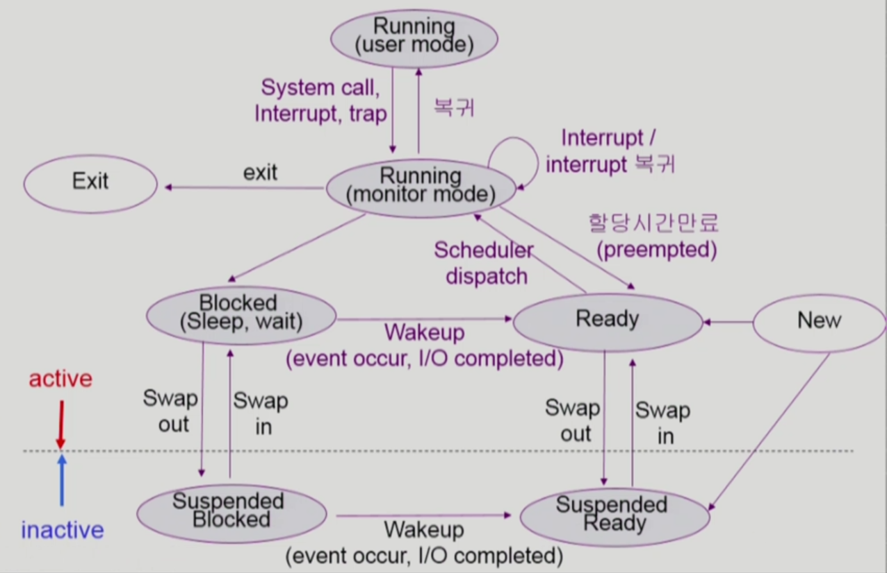

## 운영체제 5강

* 프로세스 상태
  * Running
    * CPU를 잡고 Instruction을 수행중인 상태
  * Ready
    * CPU를 기다리는 상태 (메모리 등 다른 조건을 모두 만족한 상태에서)
  * Blocked (wait, sleep)
    * I/O 등의 event를 (스스로) 기다리는 상태
    * 예) 디스크에서 파일 읽어와야 할 때
    * 자신이 요청한 event가 만족되면 Ready로..
  * Suspended (stopped)
    * 외부적인 이유로 프로세스 수행이 정지된 상태
    * 프로세스는 통째로 디스크에 swap out 된다.
    * 예) 사용자가 프로그램 일시 정지시킨 경우 (break key?)
      시스템이 여러 이유로 프로세스를 잠시 중단시킴
      (메모리에 너무 많은 프로세스가 올라와 있다던가..)
    * 외부에서 Resume을 해줘야 Active..

* 문맥교환 (Context Switch)

  * 개인적으로 책/그외 학습자료 마다 용어를 다르게 써서 헷갈렸던 것중에 하나다. (문맥교환으로 쓰는 곳도 있고 컨텍스트 스위치로 쓰는곳도 있고..)

  * 시스템 콜이나 인터럽트 발생시 반드시 Context Switch가 일어나는건 아님

    1) 인터럽트 or 시스템 콜 -> 커널 모드에 잠깐 갔다가 Context Switch 없이 user mode 복귀

    2) timer 인터럽트나 I/O 요청 시스템 콜 (작업 시간이 긴 애들..) -> 커널모드 갔다가 Context Switch 일어남

    1번의 경우에도 PCB에 Context를 약간 저장하지만 2번의 경우 그 부담(오버헤드?)이 훨씬 크다. (eg. cache memory flush)

* 프로세스 스케줄링

  * Job Queue : 현재 시스템 내에 있는 모든 프로세스의 집합
  * Ready Queue : 현재 메모리 내에 있으면서 CPU를 잡아서 실행되기를 기다리는 프로세스의 집합
  * Device Queue : I/O Device의 처리를 기다리는 프로세스의 집합
  * 프로세스들이 다양한 큐에 줄을 서서 작업을 하게된다.
  * 프로그램이 시작되면 Ready Queue에 와서 줄을 선다. 그뒤에 CPU를 이용하다가, 작업이 끝나면 다른 작업을 하러 가거나 Ready Queue에 와서 다시 줄을 서게된다.
    * 만약 CPU 이용 도중에 시간이 오래걸리는 I/O 작업이 있는 경우 I/O Queue에 가서 줄을 서서 처리한 뒤에 다시 Ready Queue에 와서 줄을 서게된다.
    * 그 외에 다른 상황은 자식 프로세스를 만든다거나 (fork a child) 인터럽트에 걸렸다던가 (wait for an interrupt) 하는 상황들이 있다.

* 스케줄러 (Scheduler)

  * Long-term scheduler (장기 스케줄러 or Job scheduler)
    * 시작 프로세스 중 어떤 것들을 Ready Queue로 보낼지 결정
    * 처음 프로세스가 시작되고 나서 메모리에 올라가는 것을 admit 해주게 되면 메모리를 얻을 수 있는데, Job scheduler은 얘네중 어떤 애들한테 줄지말지 결정함
    * 프로세스에 메모리 및 각종 자원을 주는 문제
    * degree of Multiprogramming을 제어 (메모리에 올라가있는 프로세스의 수를 제어)
      * 예를 들어 메모리에 올라가있는 프로그램의 수가 10개면 degree of Multiprogramming 수치는 10이다.
      * 간단하게 쓰면 메모리에 몇개를 올려놓을지 정하는거다. (CPU가 최대한 놀지 않고 효율적으로 일할 수 있게)
    * time sharing system에는 보통 장기 스케줄러가 없음 (무조건 ready)
  * Short-term scheduler (단기 스케줄러 or CPU scheduler)
    * 다음번에 어떤 프로세스한테 CPU를 줄지 결정함
    * 굉장히 짧은 시간단위로 스케줄이 이루어진다. (밀리세컨드 단위로 충분히 빨라야 함)
  * Medium-term schedule (중기 스케줄러 or Swapper)
    * 여유 공간 마련을 위해 프로세스를 통째로 메모리에서 디스크로 쫒아냄
      * 동시에 너무 많은 프로세스가 메모리에 올라와 있으면 문제가 될 수 있으니 조절해줌
    * 요즘은 주로 Long-term보다는 Medium-term이 있고, 얘가 프로세스에게 메모리를 뺏어가며 degree of Multiprogramming을 제어한다.
    * Medium-term한테 메모리를 뺏긴 프로세스의 상태는 Suspended라고 할 수 있다.
      (Blocked랑 Suspended를 구분하자!)

* 프로세스 상태도 (강의 캡쳐함..)

  