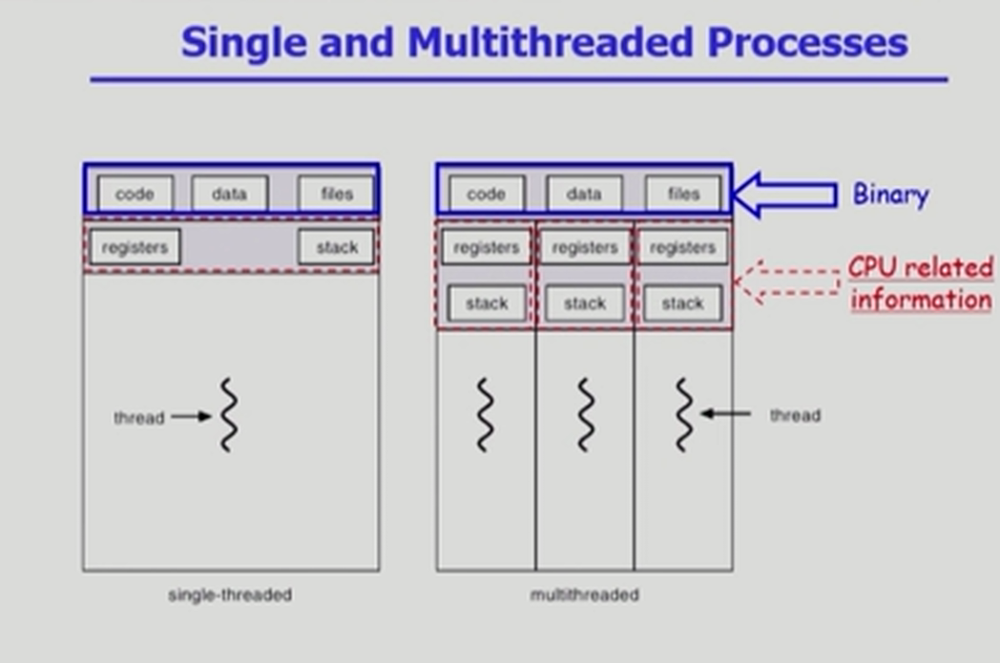

6~7강이 둘다 15분짜리라서 그냥 한번에 묶어서 정리 (어차피 같은 내용이니까!)
스레드에 대해서 잘 짚고 넘어간 아주 좋은 강의였다.

```

동기식 입출력과 비동기식 입출력에 대한 질문이 많이 나와서 부연설명을 드리고 진행하겠습니다

일단 동기식 입출력이라는 것은 어떤 프로세스가 입출력 요청을 했어요 근데 입출력 요청은 본인이 직접하는게 아니라
운영체제를 통해서 해야되기 때문에 사용자 프로세스는 운영체제에게 입출력을 요청을 하죠 그러고나서
입출력은 좀 오래 걸려서 수행이 됩니다 수행되는동안에 입출력 요청한 프로세스가 기다려야하면 정확하게 말씀 드리면 입출력이 끝날때까지 아무일을 안하고 기다려야되면 그것은 동기식 입출력입니다
사용자 프로세스가 입출력 요청을 한다음에 입출력 진행되는 동안 곧바로 CPU 잡아서 인스트럭션 실행하면 그것은 비동기식 입출력입니다

동기식과 비동기식을 비교해보면 프로세스가 입출력 진행되는 동안에 CPU를 가지고 있든 가지고 있지 않든 그건 중요하지 안아요

방금전에 말씀드렸듯이 동기식 입출력은 I/O가 완료되기전까지는 일을 못합니다

근데 그 일을 못하는 동안에 시피유를 가지고 있으면서 기다리면 구현 방법이 1이 되는거고 어차피 일 못할거 시피유는 다른 프로세스한테 넘겨주자 그러면 구현 방법2가 되는거죠
(4강 메모 참고)
요렇게 구분하시면 되겠습니다.

이 구현방법이라는건 어차피 아이오 요청을 한 프로세스가 일을 못하기 때문에 좀더 효율적으로 시피유를 쓰기 위해서 다른 프로세스한테 넘겨주는 방법이 구현 방법2고
우리가 이 수업에서 일반적으로 얘기하는게 구현 방법 2입니다

프로세스의 컨텍스트에 대해 지난시간에 설명 드렸고 세가지 상태, 컨텍스트 스위치가 일어나는 경우 그렇지 않은 경우 구분해드렸구요


오늘은 쓰레드에 대해서 말씀드릴건데요

전시간에 프로세스에 대해서 말씀드렸는데 스레드는 프로세스 내부에 시피유 수행단위가 여러개 있는 경우에 그걸 우리가 쓰레드라고 부릅니다

그래서 보통 프로세스가 하나 주어지면 여기보시는것처럼 코드 데이타 스택으로 구성된 주소 공간이 프로세스마다 만들어진다고 설명을 드렸었죠 그리고 이 프로세스 하나를 관리하기 위해서 운영체제 내부의 PCB라는걸 두고 있다고 했죠

그게 이제 프로세스의 상태를 나타낸다고 했고 프로세스의 아이디가 어떻게 되고

어느 부분을 실행하고 있는가를 가리키는 프로그램 카운터가 있고, 레지스터 셋이 있고

프로세스가 주어지면 그 프로세스만의 코드 데이타 스택이 만들어지고..

우리가 이 어떤 동일한 일을 하는 프로세스가 여러개 있다고 하면, 그거를 별도의 프로세스로 만들고 이런 메모리 주소 공간이 여러개 만들어지겠죠

프로세스마다 별도의 메모리 주소 공간이 만들어져서 공간 낭비가 이루어지고

그래서 같은 일을 하는 그런 프로세스를 여러개 띄워놓고 싶다!
그러면 주소 공간은 하나만 즉 메모리 공간은 하나만 띄워놓고 현재 각 프로세스마다 다른 부분의 코드를 실행할 수 있게 해주면 되겠죠
그게 이제 스레드의 개념입니다

스레드라는건 프로세스는 하나만 띄워놓습니다 코드 데이타 스택 요렇게 하나만 띄워놓고

그리고 프로그램 카운터만 여러개를 두는겁니다
프로세스 하나의 시피유 수행단위만 여러개 두고 있는것을 스레드라고 부릅니다

시피유 수행을 위해서는 즉 인스트럭션 수행을 위해서는 현재 코드의 어느 부ㅜㅂㄴ을 실행하고 있는지를 가리키는 프로그램 카운터가 있어야 할거구요

그 시피유에서 실행되면서 메모리의 어떤 레지스터값들을 세팅해놓고 실행을 하고 있겠죠 각 스레드마다 각 수행단위마다 현재 레지스터에 어떤값을 넣고
프로그램 카운터가 어느 부분을 가리키고 실행하고 있었는지 별도로 유지하고 있스니다

스레드 하나가 코드 어느부분을 실행하다가 함수 호출을 하면 그 함수를 호출하고 리턴하는것과 관련된 정보를 스택에 쌓아야하죠
시피유 수행단위가 여러개 있게 되면 스택도 별도로 둬야할겁니다
그래서 스레드라는거는 프로세스 하나에서 공유할 수 있는건 최대한 공유하고 즉 이 메모리 주소 공간을 공유하구요
그리고 프로세스느 ㄴ하나기 때문에 프로세스 상태를 스레드간에 공유하겠구요
그리고 이 프로세스가 사용하는 자원들도 스레드는 공유하고 있습니다 다만 별도로 가지고 있는것은 시피유 수행과 관련된 정보입니다 프로그램카운터나 레지스터나 그리고 스택같은 ㅇㅇ

요런것만 스레드간에 별도로 가지고 있게 됩니다

* Thread
A thread (or lightweight process->경량화 프로세스) is a basic unit of CPU utilization
Thread의 구성
program counter
register set
stack space

Thread가 동료 thread와 공유하는 부분 (=task)
code section
data section
OS resources

전통적인 개념의 heavyweight process는 하나의 thread를 가지고 있는 task로 볼 수 있다

다중 스레드로 구성된 태스크 구조에서는 하나의 서버 스레드가 blocked (waiting) 상태인 동안에도 동일한 태스크 내의 다른 스레드가 실행(running)되어 빠른 처리를 할 수 있다

동일한 일을 수행하는 다중 스레드가 협력하여 높은 처리율(throughput)과 성능 향상을 얻을 수 있다

스레드를 사용하면 병렬성을 높일 수 있다

--
그래서 스레드라는거는 시피유를 수행하는 단위입니다

(여기부터 7강)

빠른 응답성, 자원 절약이라는 장점.

예를 들어 아래아한글이나 웹브라우저를 여러개 띄운다고 했을때 프로세스를 별도로 띄운다고 하면 메모리 낭비가 심하겠죠

그렇지만 하나의 프로세스안에 쓰레드만 여러개 두게 되면 어떤 성능 향상이나 자원을 절약하는 효과가 있습니다

그리고 이건 시피유가 여러개 있을때만 해당하는건데 병렬성을 높일 수 있는 장점이 있구요
예를 들어 천곱하기 천 행렬을 곱할때 시피유가 여러대 있으면 각 행과 열을 곱하는걸 시피유 여러대가 각각 한다음에 합칠 수 있겠죠

여기보시면 PCB 프로세스마다 하나의 PCB가 만들어져서 운영체제가 관리하고 있다고 했는데

요 프로세스 안에 스레드가 여러개 있게 되면.. CPU 수행과 관련된 정보만 각각 스레드마다 별도의 copy를 가지게 됩니다

그래서 아까 보여드렸던 그림이죠 이 프로세스라는건 보통 메모리 주소공간에 코드 데이타 스택이 있고 각 프로세스마다 PCB가 있게 되는데 이때 스레드는 프로세스 안에서 그 독자적으로 가져야하는 정보만 이렇게 별도로 가지게 된다는거죠

주소 공간에서 코드와 데이터는 공유하게 되면 스택은 별도로 가지게 되구요

```



```

Benefits of Threads

* Responsiveness
    eg) multi-threaded Web - if one thread is blocked (eg network) another thread continues (eg display)

* Resource Sharing
    n threads can share binary code, data, resource of the process

* Economy
    creating & CPU switching thread (rather than a process)
    Solaris의 경우 위 두 가지 overhead가 각각 30배, 5배

* Utilization of MP Architectures
    each thread may be running in parallel on a different processor

스레드의 장점 아까 대강은 설명 드렸는데 크게 네가지로 요약할 수 있습니다

첫번째는 응답성이죠 사용자 입장에서 빠른겁니다 왜 빠른거냐면, 웹브라우저라는 하나의 프로그램 쓰레드를 여러개 가지고 있으면 하나의 쓰레드가 멀리 있는 서버에서 그림 파일이나 html같은거를 들고 오는 동안에...
정확히는 이렇게 설명드릴 수 있을거같아요 내가 웹브라우저를 띄워놓고 포털 사이트의 주소를 치게 되면 제일 먼저 html 문서가 날아오게되죠 그럼 그 문서를 웹브라우저 화면에 디스플레이 할려고 봤더니 그 문서안에는 여러가지 임베드된 이미지가 있어요 그럼 이제 브라우저가 해석을 해서 이미지들을 다시 웹서버한테 요청을 하죠 그 이미지들이 다 도착하면 이 화면에다가 텍스트도 집어넣고 중간중간에 이미지도 집어넣고 하나의 웹페이지를 완성해서 사용자에게 보여주게 되는거죠
그런 과정에서 제일먼저 html 문서를 읽어온 다음에 그 안에 있는 이미지를 다시 웹서버에게 요청을 하죠 근데 이게 보통 오래걸리는 작업이니 프로세스를 블럭을 시킬겁니다 사용자 입장에서는 답답하겠죠 프로세스 블럭 걸렸으니 디스플레이도 못해주고
그래서 이제 쓰레드를 여러개 사용해서 프로그램을 만들게 되면, 문서를 받아오고 이미지를 요청하는 동안에 원래라면 블럭이 되어야 하는데 이런 경우 네트웍 요청을 한 쓰레드만 블럭이 됩니다
그럼 다른 쓰레드가 이미 불러온 문서라도 먼저 디스플레이를 해주면 사용자는 답답함이 덜하겠죠 그림은 나중에 나오더라도 텍스트가 일단 나오게 되니까
그게 일단 응답성에서의 장점입니다

이게 전시간에 배웠던 동기식 입출력과 비동기식 입출력 차원에서 설명을 해보자면 이런거죠 이 이미지 파일을 읽어오는 동안에 즉 아이오를 실행하는 동안에 이 프로세스를 블럭시키는게 아니고 이 프로세스는 그 아이오가 끝나기전에 시피유를 얻어서 화면에다가 html 텍스트를 먼저 디스플레이 해주게 됩니다
이게 일종의 비동기식 입출력이라고 볼 수 있겠죠..

스레드를 사용하는 두번째 장점은 자원을 공유하는 겁니다 만약에 똑같은 일을 하는 프로그램이 여러개 있는데 이미 설명드렸죠 그걸 별도의 프로세스로 사용하는것보다는 하나의 프로세스를 만들고 그 안에 시피유 수행단위만 여러개 두게 되면 코드 데이타 그외 각종 자원은 스레드들이 공유를 하게 되죠 그렇게 되면 이제 자원을 좀 더 효율적으로 쓰는 그런 효과를 얻을 수 있겠죠

그다음에 세번째 장점은 경제성이라는건데요 이 단어자체는 좀 적절하지 않은거 같은데 빠르다는겁니다 응답성하고는 좀 다른 얘긴데
프로세스를 하나 만든다는건 오버헤드가 큽니다 그런데 프로세스 하나 안에다가 스레드 하나 추가하는건 숟가락 하나 추가하는거라 오버헤드가 크지 않아요
컨텍스트 스위치 일어날때 프로세스 넘어가면 오버헤드가 상당히 큽니다 시피유 관련 정보를 저장하고 캐시 메모리 플러시라던지 여러가지 복잡한 일들을 해야하는데
프로세스 내부에서 스레드간의 시피유 스위치가 일어나는건 대단히 간단합니다 동일한 주소 공간을 쓰고 있는거기 때문에 대부분의 문맥은 그대로 사용할 수가 있는 것이죠
그래서 이렇게 프로세스 하나를 생성하고 시피유를 스위치하는거보다 스레드 하나 생성하고 시피유 스위치하는게 오버헤드가 훨씬 적은데
솔라리스의 경우 각각 스레드를 생성하는거보다 프로세스 하나를 생성하는 오버헤드가 30배 더 들고 시피유 스위치 할 때도 5배 더 들게된다는것입니다
그러니 가능하면 같은일을 하는 작업 같으면.. 프로세스를 여러개 만드는거보다 프로세스 안에서 스레드를 여러개 두는것이 효율적이라는것이죠

여기까지 말한 세가지는 시피유가 한개일때도 적용되는건데 마지막 네번째는 시피유가 여러개일때 적용되는 장점입니다

멀티 프로세스 아키텍쳐... 이런 경우 프로세스가 하나지만 스레드가 여러개인경우 서로 다른 cpu에서 병렬적으로 일을 할 수 있죠
그럼 더 결과를 빨리 얻을 수 있는 장점이 있습니다

스레드 구현에 대해 자세한 설명은 드리지 않겠습니다만 어떤 스레드는 커널의 지원을 받고 있고 어떤 스레드 구현방식은 라이브러리 형태로 구현을 하고 있습니다
각각을 커널 스레드 유저 스레드 이런식으로 부르는데 여기나와있는 시스템들 최근의 새로운 시스템들 인터페이스가 나오면서 조금씩은 의미가 섞여있고 그런데요

개념만 간단하게 설명드리자면 커널 스레드는 스레드가 여러개 있다는 사실을 운영체제 커널이 알고 있습니다. 그래서 하나의 스레드에서 다른 스레드로 시피유가 넘어가는 것도
커널이 그 시피유 스케줄링을 하듯이 넘겨주게 됩니다 그것이 커널 스레드이고
유저 스레드는 라이브러리를 통해서 지원된다고 말씀드렸는데 요건 그 프로세스안에 스레드 여러개가 있다는 사실을 운영체제는 모르고 유저 프로그램이 스스로 여러 스레드를 관리하는겁니다
라이브러리 지원 받아서 ㅇㅇ

그래서 이 유저레벨 스레드는 어떻게 보면 커널이 모르고 있고 커널이 볼때는 그냥 일반적인 프로세스로 보이는데, 그런데 프로세스 본인이 내부에서 시피유 수행단위를 여러개 두면서 관리를 하는거기 때문에
약간의 제약점? 구현상의 그 제약점들은 있을 수 있어요

이정도로 해서 3장 부분을 마치도록 하겠습니다
```