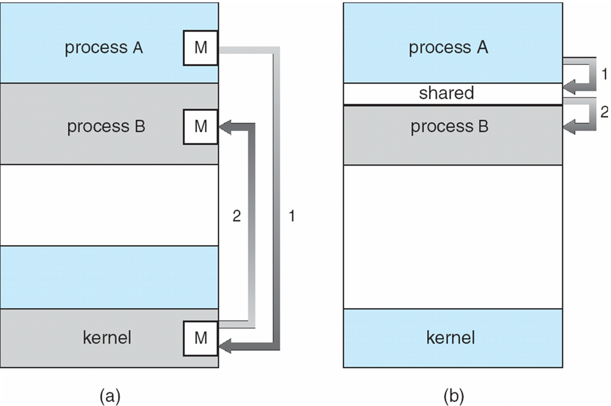

```

Copy-on-write (COW)
* 프로세스 생성 (Process Creation)
- 부모 프로세스(Parent Process)가 자식 프로세스(Children Process) 생성
- 프로세스의 트리(계층 구조) 형성
- 프로세스는 자원을 필요로 함
    - 운영체제로부터 받는다
    - 부모와 공유한다
- 자원의 공유
    - 부모와 자식이 모든 자원을 공유하는 모델
    - 일부를 공유하는 모델
    - 전혀 공유하지 않는 모델
- 수행 (Execution)
    - 부모와 자식은 공존하며 수행되는 모델
    - 자식이 종료(terminate)될 때까지 부모가 기다리는(wait) 모델

- 주소 공간(Address space)
    - 자식은 부모의 공간을 복사함 (binary and OS data)
    - 자식은 그 공간에 새로운 프로그램을 올림
- 유닉스의 예
    - fork() 시스템 콜이 새로운 프로세스를 생성
        - 부모를 그대로 복사 (OS data except PID + binary)
        - 주소 공간 할당
    - fork 다음에 이어지는 exec() 시스템 콜을 통해 새로운 프로그램을 메모리에 올림

-------------------------------------------------------------------------------------

오늘은 fork와 exec 시스템 콜의 실제 코드 (이걸 사용해서 사용자가 프로세스 만드는 코드)를 보여드릴까 합니다

* A process is created by the fork() system call.
    - creates a new address space that is a duplicate of the caller.

```
```C
/* fork() 시스템 콜 */
int main() {
    int pid;
    pid = fork();
    if (pid == 0) { /* this is child */
        printf("\n Hello, I am child!\n");
    }

    else if (pid > 0) { /* this is parent */
        printf("\n Hello, I am parent!\n");
    }
}
```
```

여기보시면 이제 c언어 코드가 하나 소개 되어있죠
메인함수가 시작되고 있고 여기보시면 빨간색으로 fork라는 함수를 호출하고 있는데 이게 바로 시스템 콜입니다
운영체제한테 새로운 프로세스를 하나 만들어달라는 그런 요청인것이죠

우리가 보통 함수르 ㄹ호출하게 되면, 그 함수에 해당하는 기능을 수행하고
그다음에 이제 그 함수가 끝나면 뭔가 필요한 리턴 밸류를, 결과값을 반환하고
그다음 나와 있는 코드를 계속 수행하게 되죠
이 fork 시스템콜도 마찬가지입니다 그런데 조금 이제.. 그전에 순차적으로 실행하는 코드에만 익숙하시면 fork의 결과.. 프로세스가 하나 생성되는 이 부분이 익숙하시지 않을수가 있습니다
어떻게 생각하는게 편하냐면, 이 코드를 하나 카피해서 옆에 붙여놓고 보는겁니다
그런다음에 일단 처음에는 이 프로그램 (왼쪽) 하나입니다 부모가 아직 자식 안낳은 상태 ㅇㅇ
얘가 진행하다가 fork를 만나서 자식 프로세스를 하나 생성합니다 그럼 옆에 하나 생기게 되는 겁니다
이 함수 실행 끝났으면 부모 프로세스는 아무 일 없다는듯이 밑에 코드 마저 실행하고,

자식 프로세스는 새로 하나 만들어졌습니다, 그런데 이게 메인 함수의 시작부분부터 실행하는게 아니라 fork의 실행 시점 이후부터 코드가 실행되는겁니다
(이거 중요!)

부모 프로세스의 문맥을 컨텍스트를 그대로 복사한다고 말씀드렸죠
그러니 부모 입장에서는 프로그램 카운터가 여기를 가르키고 있다고 말했을겁니다 (fork부분)

그런데 자식이 이제 이걸 카피를 하니까, 방금전에 fork를 했구나 (내가 아니고 부모가 했구나)
자식은 방금전까진 fork까지 실행됐구나라는 기억을 가지고 코드를 실행하게 되는겁니다

예전에 이런 식으로 코드가 있으면 포크가 무한대로 발생하겠네요? 라는 질문이 있었는데 아주 좋은 질문입니다 포크의 작동 방식에 대해서 잘 알게될 수 있는 질문이죠

이걸 (포크에 대해 설명한 내용들을) 정확하게 이해하셔야겠습니다

이제 문제가 이 친구(자식)가 자신이 원본이라고 주장하는거죠 그러면서 부모를 복제본 취급 하는거죠 그러면 상당히 혼란스러운... 상황이 생기게 되는데
그게 하나 문제가 되겠구요

그다음에 포크를 하게 되면 부모랑 똑같은게 만들어지게 되니까 세상에 있는 프로그램들은 모두가 그 똑같은... 제어흐름을 따라가야할거 같고
이런것들이 포크를 했을때 생각할 수 있는 두가지 문제점이 되겠죠


그런데 운영체제가 프로세스를 복제해서 자식을 만들어주게 되면, 자식과 부모를 구별을 해줍니다
어떻게 구분하느냐? 하면 포크라는 함수의 리턴밸류, 즉 결과값이 다릅니다
포크하고 나면 부모에서는 결과값이 양수가 얻어집니다. 정확하게 말하면 자식프로세스의 PID, 주민등록번호를 얻게 되어서 양수고
자식 프로세스는 포크를 한 결과값으로 0을 받습니다.

그래서 서로 내가 원본이고 복제본이다 구분할 수가 있는것이죠
그래서 이렇게 포크의 리턴밸류 다르기 때문에 부모 프로세스하고 자식 프로세스는 다른 일을 하게 할 수 있겠죠

그래서 포크의 결과값이 0이면 이걸 실행하고, 0이 아니면 저걸 실행하게 하라고 했을때
부모는 양수니까 밑에꺼를 실행하겠죠 그래서 hello i am parent 출력하게 될거구요

자식은 fork의 결과값이 0이니까 if문 첫번째꺼를 만족해서 hello i am child 출력하고 그다음꺼는 건너뛰게 되겠죠

이런식으로 부모랑 자식에게 다른 일을 시킬 수가 있죠 그걸 지금 설명 드렸습니다.

그다음에 여기는 써있지 않지만, 다른 코드들이 포함되어있다고 한번 해보죠

```
```C
int main() {
    int pid;
    printf("\n Hello, I am child!\n"); /* 새로 추가한 코드 */
    pid = fork();
    if (pid == 0) { /* this is child */
        printf("\n Hello, I am child!\n");
    }

    else if (pid > 0) { /* this is parent */
        printf("\n Hello, I am parent!\n");
    }
}
```
```

자 이러면 부모 프로세스가 시작하면서 이 구문을 출력하게 될거고, 그다음에 포크를 하죠
그럼 자식 프로세스는 프로그램 카운터가 이 부분(`pid = fork();`) 가리키고 있으니까
'아 여기까지 과거에 실행했을거야'라는 기억을 가지고 있죠?
하지만 실제로 실행한건 아니죠 부모가 실행한거니까..

어쨌든 자식은 해당 구문을 실행하지 않고 fork 아래에 있는 구문들만 실행하게 됩니다

이렇게 되면은 어쨌든 세상에 같은 그 코드를 가지는 실제로 제어흐름에서는 다른 브랜치로 나아갈 수 있지만
같은 흐름을 가지는 코드만 존재할텐데.. 실제로는 그렇지 않고 다른 프로그램들을 실행시킬 수 있어야겠죠

그래서 존재하는 시스템콜이 exec 시스템콜이라는겁니다
exec 시스템콜은 어떤 프로그램을 완전히 새로운 프로세스로 태어나게 해주는 그런 역할을 해줍니다

그래서 여기 코드를 보시면, 일단 fork를 해서 자식 프로세스를 하나 만들었죠
그런다음에, 부모 프로세스라면 화면에 이걸 출력하도록 하고 자식 프로세스는 화면이 이걸 출력하게 한다음에 execlp 함수를 실행하게 합니다
```
```C
int main() {
    int pid;
    pid = fork();
    if (pid == 0) { /* this is child */
        printf("\n Hello, I am child! Now I`ll run date \n");
        execlp("/bin/date", "/bin/date", (char *) 0);
    }
    else if (pid > 0) { /* this is parent */
        printf("\n Hello, I am parent!\n");
    }
}
```
```

execlp는 일종의 함수인데, 이 함수가 결국은 exec 시스템콜을 하게 됩니다 그래서 exec 시스템콜은 지금 이런 프로그램, 이런 코드를 가진 프로그램이 실행이 되다가
exec 시스템콜을 만나게 되면 요런 기억은 완전히 잊어버리고, 여기 이제 소개되는 새로운 프로그램으로 완전히 덮어씌우는 겁니다

예를 들어 지금까지는 이렇게 살았지만, exec을 해주는 센터에 가서 exec을 딱 하게 되면 저는 완전히 새로운 사람으로 살게되는것인데

exec을 하면 이 프로그램(exec으로 실행하는거)의 메인 함수부터 새로 실행하게 됩니다

아까처럼 두개를 띄워놓고, 이 오른쪽에 있는거가 /bin/date의 코드다 그러면 자식 프로세스는 화면의 printf에 이 문자를 출력한다음에 date라는 새로운 프로그램으로 덮어써서 실행하고
date 실행이 끝나면 본인의 운명이 다하게 되는거죠
exec를 하면, 되돌아 올 수 없습니다. exec으로 새로 태어나면 다시 돌아갈 수 없고 그냥 거기서 살아야되는겁니다

지금 소개해드린 코드는, 그 자식 프로세스를 포크한다음에 자식에게 완전히 새로운 프로그램을 덮어씌우기 위해서 exec을 한것이죠
그렇지만 꼭 exec이라는게 자식을 만들어서 exec 해야되는건 아닙니다 사실은.

여기서 아예 fork를 빼버리고, 이런식으로 프로그래밍을 할 수도 있어요

```
```C
int main() {
    printf("\n Hello, I am child! Now I`ll run date \n");
    execlp("/bin/date", "/bin/date", (char *) 0);
    printf("\n Hello, I am parent!\n");
}
```
```

여기는 이제 fork가 없죠 이 프로그램 실행하면, hello i am child를 출력합니다
그다음에 exec 했기 때문에 이제 이걸 완전히 잊어버리고, date 실행 시켜서 date의 메인 함수 시작부터 맨끝까지 실행하게 될겁니다

그러므로 exec 밑에 있는 이 코드는 실행이 불가능합니다 이미 덮어써버렸으니까, 영원히 실행이 안되는 코드라는것이죠

이 date라는 프로그램이 여러분들 조금 익숙하지 않다면은, 이런 printf 해가지고 그냥 1을 출력하고
프로그램중에서 echo라는 커맨드가 있습니다 뒤에 나오는 argument를 화면에 그대로 출력해주는겁니다

C언어에서 printf라는 문장하고 유사하다고 생각하심 되는데 예를 들어
```
```C
int main() {
    printf("1");
    execlp("echo", "echo", "3", (char *) 0);
    printf("2");
}
```
```

1이 출력이 되고, echo라는 프로그램으로 덮어써서 3이라는 문구가 출력되고 종료가 됩니다.
2는 영원히 출력이 안되겠죠.

execlp에는 echo를 이런식으로 실행시키는데, 실제로 리눅스의 쉘 환경에서는..
echo 3하고 엔터를 치면 화면에 3이 출력이 됩니다. 또는 echo 하고서 hello 3 이렇게하면 화면에 hello 3이 출력이 되고.
echo는 이 뒤에 나오는 아규먼트를 출력해주는 리눅스 커맨드에요

그런데 이런 커맨드를 exec로 실행시키려면 execlp에다가 프로그램 이름을 두번 써주고, 콤마로 구분해서 따옴표 안에 아규먼트를 순차적으로 넣어주고 마지막에는 항상 캐릭터 포인터 0을 적어주게 됩니다

이렇게 해서 fork랑 exec 두개의 시스템 콜 말씀드렸구요

이제 프로세스에 관련한 시스템 콜을 설명드릴건데 fork랑 exec 설명 드렸고 세번째로 wait 시스템 콜에 대해 설명드릴겁니다

wait 시스템 콜은, 이 프로세스를 잠들게 하는겁니다. 블럭상태로 우리가 전 챕터에서 배웠던 이 블럭상태로 보내는건데
보통 blocked 상태라는건 오래걸리는 이벤트를 기다리고 그 이벤트를 만족하면 다시 cpu를 얻을 수 있는 레디상태로 돌아오는거였죠

예를 들어 io 작업을 하게 되면 그 프로세스를 블럭드 상태로 보내고 그랬었는데
wait 시스템콜을 하면서 뭘 기다리면서 블럭이 되느냐?
자식 프로세스가 종료되길 기다리면서 블럭드 상태가 되는겁니다
그러다가 자식이 종료되면 부모 프로세스가 블럭드에서 레디 상태로 바뀌어서 cpu를 얻을 수 있게 되는것이죠

부모 프로세스가 실행하게 되는 코드에다가 wait 시스템 콜을 넣어주면, 그대로 잠들게 됩니다
언제까지 기다리느냐. 자식 프로세스 코드가 정의되어있었을건데 이걸 다 실행하고 종료되면 부모 프로세스가 wait 끝나고 빠져 나가서 코드를 실행하게 되는것이죠

* 프로세스 A가 wait() 시스템 콜을 호출하면?
    - 커널은 child가 종료될 때까지 프로세스 A를 sleep 시킨다 (block 상태)
    - Child process가 종료되면 커널은 프로세스 A를 깨운다 (ready 상태)

```

```

그 자식을 낳아놓고 둘이 경쟁하면서 cpu를 먼저 잡으려고 하는 모델이 있고, 자식이 종료될때까지 부모가 기다리는 모델이 있는데 지금 wait 시스템 콜을 하게 되면
부모 프로세스가 기다리게 되는 두번째 모델에 해당되는것이죠.
이런 식으로 wait 시스템콜을 하는 대표적인 예가, 리눅스에서 예를 들면 어떤 프로그램 A를 실행시키면서 그냥 엔터를 치면 리눅스는 커맨드라인이 쭉 뜨거든요
거기다 어떤 프로그램 이름 치고 엔터 치면 그 프로그램 실행되고 종료되면 다시 새로운 프로그램을 입력할 수 있는 프롬프트가 뜨고 이렇게 되는데.
여기서 요런 모델이 바로 사실은 wait 시스템콜을 호출하는 모델이에요
여기 그 리눅스에서 이렇게 뭔가 프로그램 이름을 넣으라고 깜빡깜빡하면 사실 프로그램이 떠있는 상황이고, 여기다 프로그램 이름을 치고 엔터를 치게 되면
보통 쉘이라고 하는데 그 쉘의 자식 프로세스 형태로 생성되는겁니다
이 자식이 실행되는 동안에는 이걸 띄웠던 쉘 프롬프트는 웨이트 상태로 가서 기다리게 되는겁니다
그런다음에 자식 프로세스가 종료되면 다시 커맨드를 입력받을 수 있도록 프롬프트를 띄우고 ㅇㅇ 그래서 입력 받을 수 있는 상황이 되는것이죠

부모와 자식이 병렬적으로 실행되는 경우도 있지만, 자식 프로세스를 낳아놓고 자식이 종료될때까지 기다리는 실행 모델도 있다는걸 알아두시면 되겠구요

마지막으로 exit 시스템콜입니다
exit 시스템콜은 프로세스를 종료 시킬 때, 그때 호출하는 시스템 콜이죠

* exit() 시스템 콜
- 프로세스의 종료
    - 자발적 종료
        - 마지막 statement 수행 후 exit() 시스템 콜을 통해
        - 프로그램에 명시적으로 적어주지 않아도 main 함수가 리턴되는 위치에 컴파일러가 넣어줌

    - 비자발적 종료
        - 부모 프로세스가 자식 프로세스를 강제 종료시킴
            - 자식 프로세스가 한계치를 넘어서는 자원 요청
            - 자식에게 할당된 태스크가 더 이상 필요하지 않음
        - 키보드로 kill, break 등을 친 경우
        - 부모가 종료하는 경우
            - 부모 프로세스가 종료하기 전에 자식들이 먼저 종료됨

---------------------------------------------------------------

앞에 뭐 이런 코드가 있지만, 여기다가 여러분이 예를 들어서 exit 시스템 콜을 해버리면
프로그램이 시작이 되서 printf 하나만 하고 프로그램이 종료되는거겠죠 뒤에꺼는 실행이 안되고
프로그램에서 명시적으로 엑싯을 할 수도 있고요
엑싯 안썼더라도 컴파일러가 필요한 시점에 넣어서 프로그램 끝날 시점에 엑싯 시스템콜이 호출되도록 그렇게 만들어놓습니다

그래서 엑싯 시스템콜은 이제 프로그램이 자발적으로 종료될 때, 보통 실행이 됩니다.
마지막 그 문장을 실행한 다음에 엑싯 시스템콜을 호출하게 되는데 마지막 문장이라는거는 제일 아랫쪽일수도 있고
중간에있으면 중간에 있는 그게 마지막 문장일수도 있죠

그 다음에, 비 자발적인 종료
본인은 막 열심히 실행하고 있을수도 있을겁니다 그런데 밖에서 누가 종료 시킬수도 있구요

부모 프로세스가 자식을 죽이는게 대표적인 예가 되겠죠
어떤 한계치를 넘어서는 자원을 요청했거나, 또는 자식 프로세스한테 일을 시켰는데 더이상 시킬일이 없다거나 그럴때 자식 프로세스를 강제로 종료시키는 경우가 있겠구요
그다음에 사람이 키보드로 컨트롤 씨 같은걸 누르면 그 프로그램이 강제 종료가 되죠
여기(윈도우)서는 가위표를 누르면 소위 강제종료..

또는 kill이라는 커맨드를 사용해서 프로세스를 강제로 죽일수 있고 이런식으로 비자발적으로 종료되는게 있습니다

또는 부모 프로세스 본인이 죽는 경우에.. 자식이 먼저 죽어야 하는 룰이 있어서 계층 다 내려가서 끝에 있는 자식들까지 다 죽고
그래서 지금까지, 프로세스하고 관련된 시스템 콜을 네가지 소개해드렸습니다.
부모 프로세스를 복제 생성하는 포크라는 시스템콜이 있었구요.
그다음에 완전히 새로운 프로그램으로 덮어씌우는 그런 exec이라는 시스템콜이 있었습니다
그다음에 자식이 종료될 때까지, 잠들어서 기다리는 요런 wait 시스템콜이 있었고
프로세스를 종료시키는 exit 시스템콜이 있었습니다. 이렇게 네가지가 프로세스를 생성하거나 종료시키는 그런 시스템콜이 되겠습니다

* 프로세스 간 협력
- 독립적 프로세스 (Independent process)
    - 프로세스는 각자의 주소 공간을 가지고 수행되므로 원칙적으로 하나의 프로세스는 다른 프로세스의 수행에 영향을 미치지 못함
- 협력 프로세스 (Cooperating process)
    - 프로세스 협력 메커니즘을 통해 하나의 프로세스가 다른 프로세스의 수행에 영향을 미칠 수 있음
- 프로세스 간 협력 메커니즘 (IPC : Interprocess Communication)
    - 메시지를 전달하는 방법
        - message passing : 커널을 통해 메시지 전달
    
    - 주소 공간을 공유하는 방법
        - shared memory : 서로 다른 프로세스 간에도 일부 주소 공간을 공유하게 하는 shared memory 메커니즘이 있음
        - thread : thread는 사실상 하나의 프로세스이므로 프로세스 간 협력으로 보기는 어렵지만, 동일한 process를 구성하는 thread들 간에는 주소 공간을 공유하므로 협력이 가능
----------------------------------------------------------

이렇게 해서 프로세스에 대한 설명을 어느정도 드렸고..
그다음에는 이제 프로세스 간의 협력에 대해서 말씀을 드릴겁니다.

원칙적으로 프로세스는 대단히 독립적입니다. 자식을 하나 낳아놓으면 그때부터는 자기 먹고 살거는 스스로 챙기죠 코드 데이타 스택 직접 본인꺼 만들고 메모리를 좀 더 얻어서 이제
뭐 시피유도 많이 얻을려고 하면서 서로 경쟁하면서 실행하는 독립적인 프로세스이기 때문에 프로세스의 세계에서는 원칙적으로 하나의 프로세스가 다른 프로세스의 수행에 영향을
미치지는 못합니다. 물론 부모가 자식을 죽이는 경우가 있긴 하지만 ㅇㅇ 뭔가 서로 상부상조하면서 데이타 실행을 하고 그렇진 않은데요.
경우에 따라서 프로세스들이 협력을 해야지만 더 효율적으로 실행되는 경우가 있을겁니다. 프로세스의 협력은 뭔가 정보를 주고 받으면서 실행하는겁니다

프로세스의 세계에서는 그래서 협력 메커니즘이 존재합니다. 그걸 IPC라고 부르는데요.

프로세스간에 정보를 주고 받을 수 있는걸 IPC라고 부르고 IPC에는 크게 두 가지 방법이 있습니다.
shared memory하고 message passing이 있는데요.
먼저 message passing은 프로세스 A가 프로세스 B한테 뭔가 메시지를 전달하고, 그걸 듣고 그 영향 받아서 프로세스 B가 실행이 되고 또 프로세스 B가 실행되다가 A한테 메시지 보내고..
근데 프로세스는 원체 독립적이에요 자기 메모리 주소 공간만 볼 수 있고 내가 다른 프로세스한테 메시지를 보낼 수 있는 방법이 원래는 없어요.
어떤 방법으로 메시지를 전달하느냐 하면, 커널을 통해서 메시지를 전달합니다.
중간에 커널이 뭔가 메신저 역할을 해주는 그런 경우가 되겠죠.
그래서 메시지 패싱은, 원칙적으로 프로세스들 사이에는 공유 변수가 있는것도 아니고 각자 자기 주소 공간에 있는 자기 코드만 실행을 하고 자기 데이타만 값을 바꾸고 가능하기 때문에
이제 다른 프로세스한테 정보를 전달할때는 메시지를 보낸다는 거죠.
메시지 직접 보낼 수가 없고 운영체제 커널을 통해서 메시지를 전달하는것인데요.
메시지 패싱하는 방법은 또 두가지 방법으로 나눌 수가 있습니다.

* Message Passing
- Message System
    - 프로세스 사이에 공유 변수 (shared variable)를 일체 사용하지 않고 통신하는 시스템

- Direct Communication
    - 통신하려는 프로세스의 이름을 명시적으로 표시

    |Process P| -----------------> |Process Q|
    Send(Q, message)               Receive(P, message)

- Indirect Communication
    - mailbox (또는 port)를 통해 메시지를 간접 전달

    |Process P| -------|Mailbox M|------> |Process Q|
    Send(Q, message)                      Receive(P, message)

-------------------------------------------------------------

상대 메시지를 받아볼 프로세스 이름을 명시하느냐, 명시하지 않느냐에 따라서 다이렉트 커뮤니케이션이랑 인다이렉트 커뮤니케이션으로 나눌 수 있습니다.

이 두가지로 나누지만, 어쨌든 메시지를 전달하려면 운영체제 커널을 통해서 전달할 수 있다는거는 똑같아요.
프로세스 대 프로세스로 사용자끼리 뭔가 전달하는건 불가능하므로 운영체제 커널이 중간에 있어야합니다.

```

```
